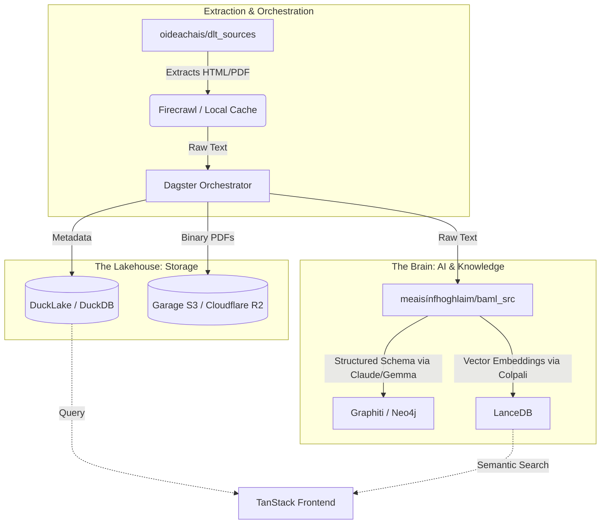

# 🏛️ Oideachais (Kings' College Galway) by Cianfhoghlaim - Unified Celtic Education Platform

*v0.7 A unified data platform and research repository for education and cultural preservation.*


I will be doing all of the critical work that require computation and hope to deploy a version that provided core value to this year's leaving certificate in advance of each of exam but due to disability and ongoing defamation that lead to assault which caused myoclonic seizures and fatigue none of that can be relied upon.

**Development Timeline Update:**
Due to hardware infrastructure delays, the deployment of a fully autonomous, interactive agent capable of navigating syllabi and historic examination papers has been recalibrated for release by 01/06/2026. This system is designed for self-hosting on localized ARM architecture (e.g., Apple Silicon M1+) or via cloud-based API credits. Intermediate educational resources, such as those housed within the `bunchloch/ardteist` module, are provided to support ongoing academic preparation, though immediate completion remains unassured.

**The Myth of Meritocracy — Feat 2027:**
By the 2027 examination cycle, the entirety of tertiary-level modules at the University of Galway will be algorithmically indexed. All public documentation, including historic examination papers, will undergo rigorous machine-learning analysis to provide equitable support for students across all intersections of race, gender, disability, and sociocultural background. This initiative encompasses a statistical audit of institutional regulations, systematically documenting historical administrative failures—including instances of misogyny, ableism, and breaches of fiscal trust regarding the Student Gym and Student Levy. While such institutional malfeasance is pervasive across the higher education sector, it is unequivocally repudiated by Kings' College Galway. The data engineering protocols for this endeavor are established; however, to counteract ongoing defamatory actions by the current Dean of Students—who deliberately concealed the QA611 formal complaint submitted on 04/09/2024—portions of this project require public development as an incontrovertible alibi against continued administrative obfuscation.

**Project Status & Architectural Caveats:**
This repository constitutes an active, evolving architecture designed to autonomously integrate forthcoming syllabus modifications. The primary objective is to deploy a functional prototype prior to the upcoming Leaving Certificate Computer Science examination. Folder structures, dependency matrices, and architectural paradigms remain subject to rigorous refactoring. Existing configurations, heavily influenced by rapid prototyping methodologies, do not inherently constitute endorsements of specific software suites. This endeavor stands as a public demonstration of synthesizing disparate open-source documentation (`docs/`) into a cohesive, enterprise-scale data platform. The realization of this project is heavily reliant upon advanced large language models—specifically the **Gemini CLI**, **Opencode**, **GitHub Copilot**, diverse **Model Context Protocol (MCP) servers**, and open-weight models from **HuggingFace**.

Oideachais is an advanced, AI-driven educational data platform designed to standardize curriculums across the British Isles. Beginning with a focus on English-language curriculums (GCSE, A-Level, Junior Cycle, Leaving Certificate), the platform's ultimate mission is to evolve into a comprehensive digital sanctuary for Celtic language educational nations (Ireland, Scotland, Wales, Isle of Man, Cornwall, Brittany).

## 🗺️ Strategic Roadmap & Critical Directives

### I. The Anam Initiative: High-Fidelity Environmental Simulation
As outlined in our core developmental blueprints, the Anam Initiative represents a convergence of meteorological data and real-time rendering. This system simulates the "Dust of the Celtic World"—a dynamic, particulate medium that flows according to real-world meteorological data (GRIB2/NetCDF).
*   **Aesthetic Framework:** Drawing upon the narrative gravity of Kryptonian dust, the Anam (Irish for "soul") serves as a manifestation of the land's spiritual history. It is characterized by distinct macroscopic particles and a saturated red hue, necessitating advanced shading models (Subsurface Scattering).
*   **Technical Implementation:** The architecture relies on **SpacetimeDB** for real-time data streaming, **Vector Quantization** for bandwidth efficiency, and **Strong Interpolation** (Bicubic/Catmull-Rom splines) to translate discrete weather grids into continuous fluid flow within Unreal Engine 5, Unity 6, and Godot 4. ### II. Agentic Infrastructure & Orchestration Workflows
To maintain the integrity and autonomous capabilities of this platform, all operations adhere to strict multi-agent coordination protocols:
*   **Agent Frameworks:** Utilizing `google-adk` and `agno` for hierarchical, sequential, and parallel task execution.
*   **Knowledge Graph Memory:** Leveraging `graphiti-core` for the bi-temporal tracking of evolving curriculum data, ensuring MVCC safety and accurate historical provenance.
*   **Data Orchestration:** Implementing `dagster` assets and `dlt` sources to manage streaming data pipelines and schema inference across the platform's diverse educational sources.
*   **Mandatory Session Completion:** All developmental sessions must conclude with rigorous quality gating (tests, linters, builds) and an unequivocal, successful push to the remote repository. No work is considered complete until synchronized with the central repository.

## 🌊 Core Architecture: Sruthanna

The project is organized into domain-specific 'streams' (**sruthanna**) within the root directory. This architecture utilizes a **Hybrid Strategy** that balances local high-performance compute with cloud-based orchestration.

### 🌊 The Streams (Sruthanna)

| Stream | Domain | Key Technologies & Architecture |
| :--- | :--- | :--- |
| `infrastructure/` | **Infrastructure (Taisce)** | **Multi-Cloud Zero-Trust Platform:** Pulumi IaC (Hetzner ARM + OCI ARM + Cloudflare WAF), Komodo GitOps orchestration (50+ services, 60+ procedures), Pangolin WireGuard networking (SSO, CrowdSec WAF, multi-tenant Traefik routing), Browser Automation (Hunter-Gatherer-Operator pattern), and ~45 modular Docker stacks. Secrets via 1Password Connect + Locket sidecars. |
| `oideachais/` | **Education Platform** | **Full-Stack AI Education:** TanStack Start (Frontend), FastAPI (API), Dagster v1.13 (Orchestration), and DuckLake/LanceDB (Storage). Transforms curriculums into interactive learning outcomes via Gemini 2.0/Claude 3.7. |
| `meaisínfhoghlaim/` | **Intelligence** | Opensource Huggingface.co model finetuning and educational asset generation in English and minority languages. |
| `códeolas/` | **Code Intel** | **Beads & Chunkhound:** Deep codebase analysis and indexing via MCP (Model Context Protocol) servers. |
| `crypteolas/` | **Finance Intel** | Agent OS, Federated Learning, DLT, Crypto-payments |
| `tuatha/` | **Educational MMO** | Pocket-ID, Forgejo (Community & Sovereignty) |
| `web/` | **Frontend UI** | Real-time, type-safe user interfaces and AI chat dashboards |
| `hmgcc/` | **Security Standards** | **HMGCC Compliance:** Implementation of government-grade security standards (Bailo, CyberChef, Gaffer, Stroom). |

### 📦 Tech Stack Analysis by Directory

Based on comprehensive package research across the three primary streams, here's the detailed tech stack breakdown:

#### ⚙️ **infrastructure** — Browser Automation & Infrastructure

| Category | Packages | Latest Versions & Key Features |
| :--- | :--- | :--- |
| **Core Backend** | httpx, aiohttp, fastapi, uvicorn, pydantic | FastAPI async backend with Pydantic v2 validation |
| **Agent Frameworks** | google-adk, agno, mcp, baml-py | google-adk (>=2.1.0) multi-agent coordination; agno (>=2.0.0) knowledge graphs |
| **Observability** | langfuse, logfire, mlflow, ragas, datadog | langfuse (>=2.0.0) prompt management & A/B testing; ragas (>=0.1.10) trace-based metrics |
| **Infrastructure** | @pulumi/hcloud, @pulumi/oci, @1password/connect | Multi-cloud IaC with Hetzner & Oracle Cloud |
| **Browser Automation** | @browserbasehq/stagehand, patchright, crawl4ai, skyvern | Stagehand (latest) AI-powered precision interactions; Patchright stealth Chromium |

#### 🧠 **meaisínfhoghlaim** — AI Agents & Data Engineering

| Category | Packages | Latest Versions & Key Features |
| :--- | :--- | :--- |
| **Data Orchestration** | dagster, dlt, duckdb, lancedb, neo4j | dagster (>=1.13.0) asset-based pipelines; dlt (>=1.5.0) streaming support; lancedb (>=0.15.0) HNSW indexing & MVCC safety |
| **ML/AI Core** | sentence-transformers, transformers, torch, accelerate | HuggingFace transformers with PyTorch backend |
| **Agent Frameworks** | google-adk, agno, litellm, cocoindex | google-adk (>=2.1.0) multi-agent coordination; agno (>=2.0.0) knowledge graphs |
| **Memory Systems** | cognee, graphiti-core | graphiti-core (>=0.5.0) temporal knowledge graphs; cognee (>=0.1.0) graph traversal & temporal tracking |
| **Model Training** | unsloth, trl, datasets, mlflow, wandb | unsloth (>=2024.12) multilingual support & flash attention (2x faster) |
| **Observability** | langfuse, ragas, ddtrace, opentelemetry | langfuse (>=2.0.0) prompt management; ragas (>=0.1.10) trace-based metrics |

#### 📚 **oideachais** — Education Pipeline & Frontend

| Category | Packages | Latest Versions & Key Features |
| :--- | :--- | :--- |
| **Data Orchestration** | dagster, dlt, duckdb, lancedb, neo4j | dagster (>=1.13.0) asset-based pipelines; dlt (>=1.5.0) streaming support; lancedb (>=0.15.0) HNSW indexing |
| **ML/AI Core** | sentence-transformers, transformers, torch, unsloth | sentence-transformers for curriculum embeddings; unsloth (>=2024.12) multilingual support |
| **Frontend Stack** | React, TypeScript, Vite, TanStack Router, CopilotKit, Vinxi | tanstack-start (^1.94.0) React Server Components; vinxi (^0.5.1) full-stack framework; copilotkit (>=0.1.0) AI agent UI |
| **Agent Frameworks** | google-adk, agno, cocoindex, litellm | google-adk (>=2.1.0) multi-agent coordination; agno (>=2.0.0) knowledge graphs |
| **Memory Systems** | cognee, graphiti-core | graphiti-core (>=0.5.0) temporal knowledge graphs; cognee (>=0.1.0) graph traversal |
| **Data Transformation** | sqlmesh | sqlmesh (>=0.228.1) DuckDB integration & virtual data warehouse |
| **Observability** | langfuse, ragas, ddtrace | langfuse (>=2.0.0) prompt management; ragas (>=0.1.10) trace-based metrics |

### 🔑 Latest Package Updates & Key Features

| Package | Version | Key Features |
| :--- | :--- | :--- |
| **google-adk** | >=2.1.0 | Multi-agent coordination with Google AI integration |
| **agno** | >=2.0.0 | Knowledge graphs feature for complex relationship tracking |
| **dagster** | >=1.13.0 | Asset-based pipelines with observability and partitioning |
| **dlt** | >=1.5.0 | Streaming support for real-time data pipelines |
| **lancedb** | >=0.15.0 | HNSW indexing, MVCC safety, hybrid search capabilities |
| **langfuse** | >=2.0.0 | Prompt management, A/B testing, trace-based analytics |
| **ragas** | >=0.1.10 | Trace-based metrics for RAG evaluation |
| **unsloth** | >=2024.12 | Multilingual support, flash attention, 2x faster training |
| **tanstack-start** | ^1.94.0 | React Server Components, edge runtime, streaming suspense |
| **vinxi** | ^0.5.1 | Full-stack framework with Vite-based architecture |
| **copilotkit** | >=0.1.0 | AI agent UI framework with React components |
| **graphiti-core** | >=0.5.0 | Temporal knowledge graphs with bi-temporal model |
| **cognee** | >=0.1.0 | Graph traversal, temporal tracking, multi-modal support |
| **sqlmesh** | >=0.228.1 | DuckDB integration, virtual data warehouse, CI/CD |
| **@browserbasehq/stagehand** | Latest | AI-powered precision browser interactions |
| **patchright** | Latest | Stealth Chromium browser with anti-detection |

### 🚀 Key Platform Capabilities

**Multi-Agent Orchestration:**
- **Google-ADK** enables coordinated multi-agent workflows with Google AI integration
- **Agno** provides knowledge graph-based agent memory and reasoning
- **MCP (Model Context Protocol)** for tool discovery and execution across agents

**Advanced Data Pipelines:**
- **Dagster** asset-based orchestration with partitioned asset checks
- **DLT** streaming support for real-time data ingestion
- **SQLMesh** virtual data warehouse with DuckDB integration

**Memory & Knowledge Systems:**
- **Graphiti-Core** temporal knowledge graphs with bi-temporal model for tracking curriculum changes over time
- **Cognee** graph traversal with temporal tracking and multi-modal support
- **LanceDB** HNSW indexing and MVCC safety for concurrent vector operations

**Observability & Evaluation:**
- **Langfuse** prompt management with A/B testing capabilities
- **Ragas** trace-based metrics for RAG evaluation
- **DDTrace** and OpenTelemetry for distributed tracing

**Frontend Innovation:**
- **TanStack Start** with React Server Components and edge runtime
- **Vinxi** full-stack framework with Vite-based architecture
- **CopilotKit** AI agent UI components for seamless AI integration

**Browser Automation:**
- **Stagehand** AI-powered precision browser interactions
- **Patchright** stealth Chromium with anti-detection
- **Hunter-Gatherer-Operator** pattern for scalable web scraping

**Model Training:**
- **Unsloth** multilingual support with flash attention (2x faster training)
- **TRL** and datasets for efficient model fine-tuning
- **MLflow** and WandB for experiment tracking

---

## 📚 Oideachais — Education Platform Details

> Full source: [`oideachais/README.md`](oideachais/README.md)

Oideachais is a pan-Celtic curriculum search, content management, and learning outcomes platform. It leverages AI to bridge the gap between official curriculum documents and interactive learning experiences.

### 🏗 Platform Architecture

| Component | Technology | Role |
| :--- | :--- | :--- |
| **Frontend** | TanStack Start | Type-safe, full-stack React application with high-performance streaming. Primary interface for students and educators. |
| **API** | FastAPI | High-concurrency, asynchronous Python backend. Handles LLM orchestration, vector search queries, and real-time streaming via Gemini 2.0 and Claude 3.7. |
| **Pipeline** | Dagster v1.13 ("Octopus's Garden") | Asset-based data orchestration. Manages data flow from raw PDF/HTML ingestion to final vector embeddings. Leverages AI skills, Partitioned Asset Checks, and Python 3.14 support. |
| **Storage** | DuckDB (DuckLake v1.0) & LanceDB (v0.31.0) | DuckDB for fast local analytical processing; LanceDB for multi-modal vector storage with namespace-backed federated database support. Data persisted to Cloudflare R2 for durability. |

```
                    ┌─────────────────────────────────────────────────────────────┐
                    │                    Celtic Education Platform                  │
                    └─────────────────────────────────────────────────────────────┘
                                              │
         ┌────────────────────────────────────┼────────────────────────────────────┐
         │                                    │                                    │
         ▼                                    ▼                                    ▼
┌─────────────────┐              ┌─────────────────────┐              ┌─────────────────┐
│   DLT Sources   │              │   Dagster Assets    │              │   ADK Agents    │
│                 │              │                     │              │                 │
│ • Ireland (8)   │──────────────│ • ireland_education │──────────────│ • RootAgent     │
│ • UK (12)       │              │ • uk_education      │              │ • Curriculum    │
│ • Celtic (6)    │              │ • celtic_language   │              │ • Geospatial    │
│ • Geospatial(4) │              │ • geospatial        │              │ • Translation   │
└─────────────────┘              │ • embeddings        │              │ • Corpus        │
                                 │ • evaluation        │              │ • Statistics    │
                                 └─────────────────────┘              └─────────────────┘
                                              │
         ┌────────────────────────────────────┼────────────────────────────────────┐
         │                                    │                                    │
         ▼                                    ▼                                    ▼
┌─────────────────┐              ┌─────────────────────┐              ┌─────────────────┐
│    Storage      │              │   CocoIndex Flows   │              │  Observability  │
│                 │              │                     │              │                 │
│ • DuckDB        │◄─────────────│ • curriculum_embed  │─────────────►│ • Datadog APM   │
│ • LanceDB       │              │ • translation       │              │ • Datadog LLMObs│
│ • Memgraph      │              │ • geospatial_index  │              │ • MLflow        │
└─────────────────┘              └─────────────────────┘              │ • Langfuse      │
                                                                       │ • Ragas         │
                                                                       │ • Kafka         │
                                                                       └─────────────────┘
```

### 🛠️ Deployment Configuration

- **Development**: Managed via `compose.dev.yaml` for local hot-reloading.
- **Production**: Deployed as a **Komodo Stack** on the **MacBook M4 Max**.
- **Secrets**: Injected via **Locket** sidecar, pulling from 1Password.
- **Routing**: Securely exposed via **Pangolin** at `oideachais.cianfhoghlaim.ie`.

### 🇮🇪 Ireland Education Pipelines

The `oideachais/dlt_sources/ireland/` directory is the primary data ingestion layer for the Republic of Ireland's education system. It provides a comprehensive suite of DLT (Data Load Tool) sources that crawl, extract, normalise, and deduplicate curriculum data from every major Irish education body.

#### Data Sources

| Source | Organisation | URL | Description |
| :--- | :--- | :--- | :--- |
| **Curriculum Online** | NCCA | `curriculumonline.ie` | Official portal for all Irish curriculum documentation — Aistear (ages 1–6) through Senior Cycle (16–18). Bilingual (English/Irish). |
| **NCCA** | National Council for Curriculum and Assessment | `ncca.ie` | Statutory body for curriculum development and assessment policy. Publishes specifications, guidelines, and consultation documents. |
| **SEC** | State Examinations Commission | `examinations.ie` | Administers Junior Certificate and Leaving Certificate examinations. Chief examiner reports, marking schemes, exam archives, and statistics. |
| **Oide** | Education Support Services | `oide.ie` | Continuing professional development (CPD) for teachers. Subject-specific support materials and pedagogical resources. |
| **Department of Education** | Gov.ie | `gov.ie/en/organisation/department-of-education/` | Government education policy, circulars, and official guidance documents. |

#### Pipeline Modules

**Core Curriculum Ingestion:**

- **[`curriculum_source.py`](oideachais/dlt_sources/ireland/curriculum_source.py)** — Unified entry point. Merges content from curriculumonline.ie, ncca.ie, and examinations.ie into a single, deduplicated data source organised by `(cycle, subject, language)`.
- **[`curriculum_registry.py`](oideachais/dlt_sources/ireland/curriculum_registry.py)** — Subject taxonomy and URL resolution engine. Centralised registry of all Irish curriculum subjects, cycles, levels, and source-specific URL patterns.
- **[`curriculum_document.py`](oideachais/dlt_sources/ireland/curriculum_document.py)** — Unified Pydantic model for all Irish curriculum documents. Defines `LearningOutcome`, `AssessmentInfo`, `ContentQuality`, `EducationLevel`, and `Language` enums.

**Per-Subject Sources (`subjects/`):**

- **[`subjects/base.py`](oideachais/dlt_sources/ireland/subjects/base.py)** — Foundation for per-subject DLT resources. Handles URL resolution, Firecrawl crawling with rate limiting, PDF extraction, bilingual support, and content hashing.
- **[`subjects/junior_cycle.py`](oideachais/dlt_sources/ireland/subjects/junior_cycle.py)** — Per-subject DLT resources for all 18 Junior Cycle subjects.
- **[`subjects/senior_cycle.py`](oideachais/dlt_sources/ireland/subjects/senior_cycle.py)** — Per-subject DLT resources for all 34 Leaving Certificate subjects.

**Source Adapters & Normalisation:**

- **[`source_adapters.py`](oideachais/dlt_sources/ireland/source_adapters.py)** — Normalises output from different curriculum sources into a consistent `NormalizedPage` format. Implements adapters for CurriculumOnline, NCCA, and Examinations.ie.
- **[`content_deduplication.py`](oideachais/dlt_sources/ireland/content_deduplication.py)** — Cross-source content deduplication via content hashing with source provenance tracking and canonical URL resolution.
- **[`education_sources.py`](oideachais/dlt_sources/ireland/education_sources.py)** — Configuration registry for all Irish education websites.

**Examination Data:**

- **[`exam_source.py`](oideachais/dlt_sources/ireland/exam_source.py)** — DLT source for examinations.ie. Crawls chief examiner reports (200+ PDFs), exam archives, marking schemes, and statistics.
- **[`sec_aural_transcripts.py`](oideachais/dlt_sources/ireland/sec_aural_transcripts.py)** — Parses structured transcript data from SEC aural exam scripts with dialect tags (Connacht, Munster, Ulster).
- **[`edcolearning.py`](oideachais/dlt_sources/ireland/edcolearning.py)** — Extracts Leaving Certificate exam audio resources from EdcoLearning.ie.

**Intelligent Discovery:**

- **[`agentic_discovery.py`](oideachais/dlt_sources/ireland/agentic_discovery.py)** — Uses Firecrawl agent for autonomous URL discovery and structured data extraction across Irish educational websites.
- **[`json_seed.py`](oideachais/dlt_sources/ireland/json_seed.py)** — Loads pre-existing scraped JSON data as seed data for pipeline bootstrapping.

**Statistical & Geospatial Data (`statistics/`):**

- **[`statistics/cso_small_areas.py`](oideachais/dlt_sources/ireland/statistics/cso_small_areas.py)** — Small Area statistics from CSO PxStat API (18,641 areas, Census 2022).
- **[`statistics/geohive.py`](oideachais/dlt_sources/ireland/statistics/geohive.py)** — Geospatial boundaries from GeoHive.ie (ArcGIS FeatureServer).
- **[`statistics/met_office.py`](oideachais/dlt_sources/ireland/statistics/met_office.py)** — UK Met Office DataHub integration for weather observations and climate data, supporting cross-border environmental context.

#### Data Flow Architecture

```
┌──────────────────────────────────────────────────────────────────┐
│                    Irish Education Data Sources                   │
├──────────────┬──────────────┬──────────────┬─────────────────────┤
│ curriculum   │ examinations │    ncca.ie   │    oide.ie          │
│ online.ie    │     .ie      │              │                     │
└──────┬───────┴──────┬───────┴──────┬───────┴──────────┬──────────┘
       │              │              │                  │
       ▼              ▼              ▼                  ▼
┌──────────────────────────────────────────────────────────────────┐
│                    Source Adapters (Normalisation)                │
│  CurriculumOnlineAdapter │ NCCAAdapter │ ExaminationsAdapter     │
└──────────────────────┬───────────────────────────────────────────┘
                       │  NormalizedPage
                       ▼
┌──────────────────────────────────────────────────────────────────┐
│              Content Deduplication & Provenance                   │
│         (content hashing, canonical URL resolution)              │
└──────────────────────┬───────────────────────────────────────────┘
                       │  Deduplicated pages
                       ▼
┌──────────────────────────────────────────────────────────────────┐
│              Curriculum Registry (Subject Taxonomy)               │
│    (cycle → subject → language → source URL resolution)          │
└──────────────────────┬───────────────────────────────────────────┘
                       │  Structured curriculum data
                       ▼
┌──────────────────────────────────────────────────────────────────┐
│                    DLT Pipeline → DuckDB / LanceDB                │
│              (persisted to Cloudflare R2 via DuckLake)            │
└──────────────────────────────────────────────────────────────────┘
```

#### Education Levels Covered

| Level | Ages | Qualifications |
| :--- | :--- | :--- |
| **Aistear** (Early Childhood) | 1–6 | Early Childhood Curriculum Framework |
| **Primary** | 5–12 | Primary School Curriculum (incl. redeveloped 2025 curriculum) |
| **Junior Cycle** | 12–15 | Junior Certificate / Junior Cycle (Level 1 & 2 LPs, Short Courses) |
| **Senior Cycle** | 16–18 | Leaving Certificate (Established, LCA, LCVP) |
| **Further Education** | 18+ | FETAC / QQI levels |

#### Bilingual Support

All pipeline modules support **bilingual content extraction** (English and Irish/Gaeilge). The `curriculumonline.ie` and `ncca.ie` sources maintain parallel content trees accessible via language prefixes (e.g., `/ga-ie/`). Source adapters handle language-specific URL routing and normalise both language variants into the unified schema.

#### Quick Start

```python
import dlt
from sruth.oideachais.dlt_sources.ireland import curriculum_source

# Crawl Junior Cycle Mathematics (English)
# DLT (>=1.4.0) provides streaming support for real-time data pipelines
pipeline = dlt.pipeline(
    pipeline_name="ireland_curriculum",
    destination="duckdb",
    dataset_name="ireland_education",
)

# Ingest all Junior Cycle subjects from all sources
pipeline.run(curriculum_source(
    cycle="junior_cycle",
    language="en",
))

# Or target a specific subject
pipeline.run(curriculum_source(
    cycle="senior_cycle",
    subject="mathematics",
    language="en",
))

# Per-subject sources for fine-grained control
from sruth.oideachais.dlt_sources.ireland.subjects import (
    senior_cycle_source,
    junior_cycle_source,
)

# All 34 Senior Cycle subjects
pipeline.run(senior_cycle_source(language="en"))

# All 18 Junior Cycle subjects
pipeline.run(junior_cycle_source(language="ga"))
```

**Package Versions Used:**
- **dlt** (>=1.4.0) — Streaming support for real-time data pipelines
- **Dagster** (>=1.9.0) — Asset-based pipelines with observability
- **DuckDB** — Fast local analytical processing
- **LanceDB** (>=0.15.0) — Multi-modal vector storage with HNSW indexing

**For detailed implementation guides:**
- See [`.skills/dlt/SKILL.md`](.skills/dlt/SKILL.md) for DLT pipeline patterns
- See [`.skills/dagster/SKILL.md`](.skills/dagster/SKILL.md) for Dagster orchestration
- See [`.skills/lancedb/SKILL.md`](.skills/lancedb/SKILL.md) for vector database integration

#### Pipeline Directory Structure

```
dlt_sources/
├── ireland/                        # Republic of Ireland
│   ├── curriculum_source.py        # Unified curriculum DLT source
│   ├── curriculum_registry.py      # Subject taxonomy & URL resolution
│   ├── curriculum_document.py      # Pydantic document models
│   ├── source_adapters.py          # Source normalisation adapters
│   ├── content_deduplication.py    # Cross-source deduplication
│   ├── education_sources.py        # Source site configurations
│   ├── exam_source.py              # SEC examinations source
│   ├── sec_aural_transcripts.py    # Aural transcript parsing
│   ├── edcolearning.py             # EdcoLearning audio resources
│   ├── agentic_discovery.py        # Firecrawl agent discovery
│   ├── json_seed.py                # Seed data loader
│   ├── subjects/                   # Per-subject DLT sources
│   │   ├── base.py                 # Subject source foundation
│   │   ├── junior_cycle.py         # 18 Junior Cycle subjects
│   │   └── senior_cycle.py         # 34 Leaving Certificate subjects
│   └── statistics/                 # Statistical & geospatial sources
│       ├── cso_small_areas.py      # CSO census data
│       ├── geohive.py              # GeoHive boundaries
│       └── met_office.py           # Weather/climate data
├── northern_ireland/               # Northern Ireland (UK)
│   ├── ccea_curriculum.py          # CCEA curriculum
│   ├── education_ni.py             # Education NI
│   ├── etini.py                    # ETI NI inspections
│   └── nisra.py                    # NISRA statistics
├── great_britain/                  # England, Scotland, Wales
│   ├── england/                    # National Curriculum, DfE, Ofsted
│   ├── scotland/                   # CfE, SIMD, Insight
│   └── wales/                      # Curriculum for Wales, Estyn
└── crown_dependencies/             # Channel Islands, Isle of Man
```

---

## 🏗️ Bonneagar — Infrastructure & Platform Details

> Full source: [`infrastructure/README.md`](infrastructure/README.md)

Bonneagar (Irish: "infrastructure") is the backbone of the Cianfhoghlaim platform — a **multi-cloud, zero-trust infrastructure** that provisions, orchestrates, and secures 50+ containerised services across Oracle Cloud, Hetzner, and local ARM hardware. It combines declarative IaC (Pulumi), GitOps orchestration (Komodo), WireGuard tunneling (Pangolin), and a self-hosted browser automation stack to provide the foundation for all other sruthanna.

### 🏗 Platform Architecture

| Component | Technology | Role |
| :--- | :--- | :--- |
| **IaC** | Pulumi (TypeScript), @pulumi/hcloud, @pulumi/oci | Provisions ARM servers on Hetzner Cloud and Oracle Cloud, Cloudflare DNS/WAF, and firewall rules. Includes Automation API for CI/CD deployment pipelines. |
| **Orchestration** | Komodo | GitOps-managed container orchestration across 3 servers. 60+ declarative TOML procedures for multi-cloud deployments, canary rollouts, and automated rollbacks. |
| **Zero-Trust Networking** | Pangolin + WireGuard | Identity-aware tunneled reverse proxy with SSO (Pocket ID + TinyAuth), CrowdSec WAF, Traefik v3 reverse proxy, and multi-tenant routing for `cianfhoghlaim.ie` and `aleyum.com`. |
| **Browser Automation** | @browserbasehq/stagehand (latest), Patchright, Crawl4AI, Skyvern | Hunter-Gatherer-Operator pattern: Skyvern (vision-based Hunter), Crawl4AI (bulk Gatherer), Stagehand (AI-powered precision Operator), all sharing a stealth Chromium grid. Exposes MCP, AG-UI, and TanStack AI protocols. |
| **Secrets** | 1Password Connect + Locket | Zero-disk-secret deployment via Locket sidecar containers injecting tmpfs-backed secrets from 1Password Connect. |
| **Observability** | Datadog APM + MLflow + Langfuse (>=2.0.0) + Logfire + Ragas (>=0.1.10) | Three-tier: Datadog (full APM/metrics/logs), MLflow/Langfuse (ML/LLM-specific with prompt management & A/B testing), Logfire (Python app tracing), Ragas (trace-based metrics). |
| **Agent Frameworks** | Google-ADK (>=2.1.0), Agno (>=2.0.0), MCP, BAML-py | Multi-agent coordination with Google AI integration; knowledge graphs for complex relationship tracking; Model Context Protocol for tool discovery. |

```
                          ┌─────────────────────────────────────────────────────────────────┐
                          │                    Bonneagar Infrastructure                      │
                          └─────────────────────────────────────────────────────────────────┘
                                                        │
               ┌────────────────────────────────────────┼──────────────────────────────────────────┐
               │                                        │                                          │
               ▼                                        ▼                                          ▼
 ┌─────────────────────────┐             ┌──────────────────────────┐              ┌──────────────────────────┐
 │   Pulumi IaC            │             │   Komodo Orchestration   │              │   Pangolin Networking    │
 │                         │             │                          │              │                          │
 │ • Cloudflare WAF (31 )│             │ • Core (OCI)             │              │ • WireGuard Tunnels      │
 │ • Hetzner CAX41 (ARM)   │─────────────│ • Periphery (3 servers)  │──────────────│ • Traefik v3 Reverse Proxy│
 │ • OCI Ampere A1 (ARM)   │             │ • 25 Stacks / 60+ Procs  │              │ • Pocket ID SSO          │
 │ • Automation API deploy │             │ • Canary Deployments     │              │ • CrowdSec WAF           │
 └─────────────────────────┘             │ • Staged Rollouts        │              │ • Multi-Tenant Routing   │
                                         └──────────────────────────┘              │ • TinyAuth Forward Auth  │
                                                                                    └──────────────────────────┘
                                                        │
               ┌────────────────────────────────────────┼──────────────────────────────────────────┐
               │                                        │                                          │
               ▼                                        ▼                                          ▼
 ┌─────────────────────────┐             ┌──────────────────────────┐              ┌──────────────────────────┐
 │   Browser Automation    │             │   ~45 Docker Stacks      │              │   Secrets & Observability│
 │                         │             │                          │              │                          │
 │ • Patchright Stealth    │             │ • Engineering (7)        │              │ • 1Password Connect      │
 │ • Stagehand (Operator)  │─────────────│ • Infrastructure (3)     │──────────────│ • Locket Sidecars        │
 │ • Crawl4AI (Gatherer)   │             │ • Machine Learning (5)   │              │ • Datadog APM + LLMObs   │
 │ • Skyvern (Hunter)      │             │ • Storage (18)           │              │ • MLflow + Langfuse      │
 │ • MCP / AG-UI / SSE     │             │ • Tools (9)              │              │ • Logfire + Ragas        │
 └─────────────────────────┘             └──────────────────────────┘              └──────────────────────────┘
```

### 🖥️ Multi-Cloud Server Fleet

| Server | Hardware | Location | Role | Key Services |
| :--- | :--- | :--- | :--- | :--- |
| **arm1-oci** | 4 ARM OCPUs, 24 GB RAM, 200 GB | Oracle Cloud London | Control Plane | Pangolin Core, Komodo Core, 1Password Connect, Garage S3, Forgejo, Qdrant |
| **cax41-hetzner** | CAX41 ARM, 16 vCPU, 32 GB RAM | Hetzner Nuremberg | Primary Workloads | Memgraph, FalkorDB, MLflow, Langfuse, LanceDB, Cognee, Graphiti, Dagster, Browser Grid |
| **bunchloch** | MacBook M4 Max, ~14 cores, 48 GB RAM | Local | Dev & Analytics | LakeFS, Lakekeeper, Convex, Crawl4AI, Media servers, Aleyum portal |

### 🌐 Browser Automation (`browser/`)

A self-hosted, multi-backend browser automation stack following the **Hunter-Gatherer-Operator** pattern:

| Backend | Role | Cost |
| :--- | :--- | :--- |
| **Patchright** (stealth Chromium) | Shared browser grid with anti-detection | Free (self-hosted) |
| **Crawl4AI** | High-throughput bulk extraction (Gatherer) | Free (self-hosted) |
| **Skyvern** | Vision-based semantic navigation (Hunter) | Free (self-hosted) |
| **Stagehand** | AI-powered precision interactions (Operator) | Free (self-hosted) |
| **Browserbase** | Cloud browser fallback for anti-bot | Paid |
| **Firecrawl** | Web scraping API with autonomous research | Paid |

**Domain-Specific Scrapers:**

| Scraper | Target | Extracts |
| :--- | :--- | :--- |
| [`duchas_scraper.py`](infrastructure/browser/browser/tools/duchas_scraper.py) | [duchas.ie](https://www.duchas.ie) | National Folklore Collection — 740K+ manuscript pages, images, transcriptions, metadata |
| [`canuint_scraper.py`](infrastructure/browser/browser/tools/canuint_scraper.py) | [canuint.ie](https://www.canuint.ie) | Irish dialect audio recordings — Connacht, Munster, Ulster; TTS dataset export (LJSpeech format) |
| [`examinations_scraper.py`](infrastructure/browser/browser/tools/examinations_scraper.py) | [examinations.ie](https://www.examinations.ie) | State Examination Commission — past papers (1999–2024), marking schemes, Chief Examiner Reports |

**Multi-Protocol Server:** A single FastAPI server exposes three protocols simultaneously:
- **MCP** (JSON-RPC) — Tool discovery/execution for AI agents
- **AG-UI** (17-event SSE) — CopilotKit integration
- **TanStack AI** (SSE) — Chat-based browser control

### 🔄 Komodo Orchestration (`komodo/`)

Declarative GitOps orchestration managing 25 stack definitions and 60+ automation procedures:

**Key Procedures:**

| Procedure | Purpose |
| :--- | :--- |
| [`deploy-cianfhoghlaim`](infrastructure/komodo/procedures/deploy-cianfhoghlaim.toml) | 6-stage full platform deployment across all servers |
| [`deploy-multi-cloud`](infrastructure/komodo/procedures/deploy-multi-cloud.toml) | Dependency-ordered deployment: OCI → Hetzner → Local |
| [`staged-rollout`](infrastructure/komodo/procedures/staged-rollout.toml) | Canary deployment with configurable % and auto-rollback |
| [`rollback`](infrastructure/komodo/procedures/rollback.toml) | Safe rollback with pre-flight checks and optional snapshots |
| [`health-check`](infrastructure/komodo/procedures/health-check.toml) | Aggregate health across all stacks with alerting |
| [`init-site`](infrastructure/komodo/procedures/init-site.toml) | 5-stage new site bootstrap: validate → DNS → Pangolin → Ansible → verify |

**Komodo-Managed Stacks:**

| Stack Group | Services |
| :--- | :--- |
| **Sruth Pipelines** | Oideachais, Crypteolas, Tuath, Codeolas, Browser, Taighde |
| **Dagster Unified** | Production Dagster (Hetzner) + Dev Dagster (MacBook) |
| **Hetzner Databases** | Memgraph, FalkorDB, LanceDB, Cognee, Graphiti, MLflow, Langfuse, Kafka, Nimtable |
| **OCI Control Plane** | Garage S3, Beszel, Dozzle, Qdrant, Forgejo + Runner |
| **MacBook Analytics** | LakeFS, Lakekeeper, OLake-UI, Convex, Scraping stack |
| **Pangolin Tunnels** | Newt (Hetzner), OLM (Oracle), OLM (Hetzner) |
| **Observability** | Datadog APM + LLM Observability on all 3 servers |

### 🛡️ Pangolin Zero-Trust Networking (`pangolin/`)

An identity-aware tunneled reverse proxy providing zero-trust network access:

```
Internet → Cloudflare (DNS) → Gerbil (WireGuard, 132.145.27.89) → Traefik v3 → Services
                                                                      ↓
                                                            Pangolin API → Newt/OLM tunnel agents → Remote hosts
```

| Component | Technology | Purpose |
| :--- | :--- | :--- |
| **Pangolin Core** | `fosrl/pangolin` | Identity-aware proxy with session management (30-day sessions) |
| **Gerbil** | `fosrl/gerbil` | WireGuard tunnel controller (UDP 51820, TCP 80/443/8443) |
| **Traefik v3** | `traefik:v3.4.0` | Reverse proxy with dynamic config, Let's Encrypt wildcard certs via Cloudflare DNS-01 |
| **Pocket ID** | Passkey-based OIDC | SSO provider at `auth.cianfhoghlaim.ie` |
| **TinyAuth v4** | Forward auth | OAuth integration with Pocket ID for resource protection |
| **CrowdSec** | WAF + AppSec | Intrusion detection with virtual patching on port 7422 |
| **Middleware Manager** | Traefik middleware UI | Predefined templates for auth, rate limiting, CORS, circuit breakers |

**Multi-Tenant Routing:**

| Tenant | Domain | Theme | Type |
| :--- | :--- | :--- | :--- |
| **Cianfhoghlaim** | `*.cianfhoghlaim.ie` | Celtic blue/green/gold, Inter + Playfair Display | Education Platform |
| **Aleyum** | `*.aleyum.com` | Purple/amber/pink, Space Grotesk + Orbitron | Music & Game Dev Portfolio |

**Agent-to-Agent (A2A) Resources:** Four AgentOS instances (Oideachais, Crypteolas, Browser, Aleyum) exposed via Pangolin with SSO protection, plus an internal A2A gateway for service mesh communication.

### ⚡ Pulumi Infrastructure-as-Code (`pulumi/`)

Three Pulumi projects (TypeScript) provisioning multi-cloud infrastructure:

| Project | Cloud | Resources |
| :--- | :--- | :--- |
| [`cloudflare/`](infrastructure/pulumi/cloudflare/index.ts) | Cloudflare | WAF ruleset with geo-restriction (31 allowed countries) for 4 domains |
| [`hetzner/`](infrastructure/pulumi/hetzner/index.ts) | Hetzner Cloud | CAX41 ARM server (16 vCPU, 32 GB, Nuremberg), SSH key, firewall (6 rules), Cloudflare DNS, cloud-init with Docker + sysctl tuning |
| [`oci/`](infrastructure/pulumi/oci/index.ts) | Oracle Cloud | Ampere A1 ARM (4 OCPU, 24 GB, London), VCN/subnet/IGW/security lists, wildcard DNS, Automation API deploy pipeline |

**Automation API ([`oci/deploy.ts`](infrastructure/pulumi/oci/deploy.ts)):** A 5-step CI/CD pipeline — `pulumi up` → wait for SSH → flush Oracle iptables → regenerate Ansible inventory → run Ansible playbook.

### 📦 Infrastructure Stacks (`stacks/`)

~45 modular Docker Compose stacks organised into 5 categories, each following the **Gold Standard** 5-file convention:

```
stacks/<category>/<stack>/
├── compose.yaml      # Application services (healthchecks, named volumes, bridge networks)
├── sidecar.yaml      # Locket sidecar for 1Password Connect secret injection (tmpfs, non-root)
├── secrets.env       # Locket template with {{ op://dev-baile/... }} references
├── pangolin.yaml     # Docker labels for Pangolin auto-discovery
└── blueprint.yaml    # Pangolin routing rule (domain → site → hostname → port)
```

| Category | Count | Key Stacks |
| :--- | :--- | :--- |
| **Engineering** | 7 | Coder (VS Code), Crawl4AI (scraping), LiteLLM (AI gateway), MCPJungle (MCP management), Windmill (low-code pipelines) |
| **Infrastructure** | 3 | Technitium DNS, Dozzle (log viewer), Pocket-ID (OIDC) |
| **Machine Learning** | 5 | Cognee (GraphRAG), Graphiti (knowledge graphs), Langfuse v3 (LLM tracing), LMNR (LLM observability), OLake (DB→Iceberg replication) |
| **Storage** | 18 | Garage (S3), Lakekeeper (Iceberg REST), LanceDB (vectors), Memgraph/FalkorDB (graphs), Qdrant (vector search), Kafka (streaming), Forgejo (Git/CI) |
| **Tools** | 9 | Actual (finance), Blinko (notes), Linkwarden (bookmarks), Perplexica (AI search), Romm (game library) |

### 🛠️ Deployment Configuration

- **Development**: Managed via `compose.dev.yaml` for local hot-reloading on MacBook M4 Max.
- **Production**: Deployed as **Komodo Stacks** across OCI (control plane) and Hetzner (workloads).
- **Secrets**: Injected via **Locket** sidecar, pulling from 1Password Connect at `arm1-oci:8080`.
- **Routing**: Securely exposed via **Pangolin** at `*.cianfhoghlaim.ie` with CrowdSec WAF and TinyAuth SSO.
- **DNS**: Cloudflare DNS with Let's Encrypt wildcard certificates via DNS-01 challenge.
- **Monitoring**: Datadog APM agents on all servers; MLflow/Langfuse for ML/LLM observability.

---

## ️ Knowledge & Research Vaults

Beyond the active code streams, this repository serves as a massive knowledge base for British Isles cultural and political research.

### 📚 Documentation Index (`docs/`)

The `docs/` folder contains comprehensive research and specifications across multiple domains:
*   **`docs/agents/`:** Analysis of agentic frameworks (Agno, PydanticAI, Smolagents) and MCP server implementations.
*   **`docs/teanga/`:** Resources for Irish language preservation, historical document analysis (Escriptorium), and TTS dataset generation.
*   **`docs/hmgcc/`:** Security configurations and guidance for government-grade system deployments.
*   **`docs/data_engineering/`:** Strategies for Lakehouse architectures using DuckDB, Iceberg, and LakeFS.
*   **`docs/meaisínfhoghlaim/`:** Machine learning workflows, model evaluation, and fine-tuning patterns.

### 🛠️ Skills Documentation (`.skills/`)

The [`.skills/`](.skills/) folder contains detailed skill documentation for key technologies and frameworks used across the platform. Each skill provides comprehensive guides, best practices, and implementation patterns:

**Agent Frameworks:**
*   [**agno**](.skills/agno/SKILL.md) — Multi-agent orchestration with tool calling and knowledge graphs (v2.0+)
*   [**google-adk**](.skills/google-adk/SKILL.md) — Google's Agent Development Kit for multi-agent coordination

**Knowledge & Memory Systems:**
*   [**graphiti-core**](.skills/graphiti-core/SKILL.md) — Temporal knowledge graph memory with bi-temporal model
*   [**graphiti**](.skills/graphiti/SKILL.md) — Knowledge graph for agents with HNSW indexing (v0.5+)
*   [**cognee**](.skills/cognee/SKILL.md) — Graph-based knowledge management with temporal tracking (v0.1+)
*   [**lancedb**](.skills/lancedb/SKILL.md) — Vector database for RAG with HNSW indexing (v0.15+)

**Data Pipelines & Orchestration:**
*   [**dagster**](.skills/dagster/SKILL.md) — Data orchestration platform with asset-based pipelines (v1.13+)
*   [**dlt**](.skills/dlt/SKILL.md) — Data load tool for pipelines with streaming support (v1.5+)
*   [**sqlmesh**](.skills/sqlmesh/SKILL.md) — Data transformation framework with DuckDB integration

**Observability & Evaluation:**
*   [**langfuse**](.skills/langfuse/SKILL.md) — LLM observability platform with prompt management (v2.0+)
*   [**ragas**](.skills/ragas/SKILL.md) — RAG evaluation framework with trace-based metrics (v0.1.10+)

**UI & Agent Interaction:**
*   [**copilotkit**](.skills/copilotkit/SKILL.md) — AI agent UI framework with React components
*   [**vinxi**](.skills/vinxi/SKILL.md) — Full-stack framework (Poimandres) with Vite-based architecture
*   [**tanstack-start**](.skills/tanstack-start/SKILL.md) — React framework with React Server Components (v1.94+)

**Model Training & Fine-tuning:**
*   [**unsloth**](.skills/unsloth/SKILL.md) — LLM fine-tuning with multilingual support (v2024.12+)

For detailed implementation guides and best practices, refer to individual skill files in the [`.skills/`](.skills/) directory.

### 🏛️ Political & Social Research (`gemini_deep_research/`)
A massive collection of over 140 deep-dive research documents (PDFs) generated during the project's development. This "Gemini Vault" is organized into thematic subdirectories for clarity.

**Note on Methodology**: These reports were generated using **Gemini Deep Research** with expert prompting. For detailed information on the generation process and official documentation links, see the [**Gemini Vault README**](./gemini_deep_research/README.md).

*   **`technology/`**: AI company analysis, Gemini/Google AI goals, Big Tech regulation, and cybersecurity job cycles.
*   **`politics/`**: Brexit impact, Sinn Féin/Fine Gael coalition strategy, election research, and Irish economic future planning.
*   **`law/`**: Dual citizenship jurisprudence, court forms/procedures, medical malpractice strategies, and data access inquiries.
*   **`medical/`**: TBI/C-PTSD recovery protocols, medical cannabis access, disability allowance assistance, and neuro-scientific trauma research.
*   **`culture/`**: Celtic language revitalization, Deacy family genealogy, Irish kingship claims, and Royal family research.
*   **`other/`**: Public service connectivity (Irish Rail), London borough cleanliness, and radicalization prevention strategies.

### 📥 Downloading Specific Research Data (Sparse Checkout)

This repository contains massive amounts of data, models, and PDFs. If you only want to download a specific directory, such as the University of Galway research archives, you can use Git's sparse-checkout feature to save time and disk space:

```bash
# 1. Clone the repository without downloading the files
git clone --no-checkout https://github.com/cianfhoghlaim/kings_college_galway.git
cd kings_college_galway

# 2. Initialize sparse-checkout
git sparse-checkout init --cone

# 3. Specify the directory you want to download
git sparse-checkout set bunchloch/university_of_galway

# 4. Checkout the files
git checkout main
```

---

## 🎓 Cian CV: Academic, Professional & Civic Credentials

To ensure transparency and verify the author's background, high-resolution scans of key credentials and professional references are provided below:

### 📜 Academic & Professional Records
*   **[University Degree Transcript (BA & HDip)](./cian_mac_an_déisigh_uí_liatháin/ba_and_hdip_transcript.pdf)** | **[Transcript of Results (Bilingual)](./cian_mac_an_déisigh_uí_liatháin/tras_scribhinn_torthai_transcript_of_results.pdf)**
*   **[Academic Parchment 1](./cian_mac_an_déisigh_uí_liatháin/bachelors_degree_parchment.jpeg)** | **[Academic Parchment 2](./cian_mac_an_déisigh_uí_liatháin/higher_diploma_parchment.jpeg)**
*   **[Leaving Certificate](./cian_mac_an_déisigh_uí_liatháin/leaving_certificate.pdf)** | **[Junior Certificate](./cian_mac_an_déisigh_uí_liatháin/junior_certificate.pdf)**
*   **[Torthaí Ghaeilge (Irish Results)](./cian_mac_an_déisigh_uí_liatháin/torthai_ghaeilge.pdf)**
*   **[Coláiste na Coiribe](./cian_mac_an_déisigh_uí_liatháin/colaiste_na_coiribe.pdf)** | **[Scoil Iognáid](./cian_mac_an_déisigh_uí_liatháin/scoil_iognaid.pdf)**
*   **[Teaching Placement Reference](./cian_mac_an_déisigh_uí_liatháin/gcc_placement_reference.pdf)** | **[Placement Feedback](./cian_mac_an_déisigh_uí_liatháin/teaching_placement_feedback.pdf)**
*   **[Part-Time Teaching Reference](./cian_mac_an_déisigh_uí_liatháin/part_time_teaching_reference.pdf)** | **[BME Reference](./cian_mac_an_déisigh_uí_liatháin/bme_reference.pdf)**
*   **[Apple Award](./cian_mac_an_déisigh_uí_liatháin/apple_award.pdf)** | **[Teaching Council Registration](./cian_mac_an_déisigh_uí_liatháin/teaching_registration.pdf)**

### 🛡️ Cybersecurity & Trust
*   **[Cybersecurity Professional Reference](./cian_mac_an_déisigh_uí_liatháin/cybersecurity_reference.pdf)**
*   **[University of Galway Complaint (Covered Up)](./cian_mac_an_déisigh_uí_liatháin/mgo_sean_o_gradaigh_educational_malpractice/dean_of_student_ciara_meehan_abuse_of_power/university_galway_complaint_covered_up.pdf)**
*   **[Threat Message Documentation (Evidence)](./cian_mac_an_déisigh_uí_liatháin/vetting/psni_proof_belfast.jpeg)**
*   **[Verified Lack of Criminality (Garda Vetting ROI)](./cian_mac_an_déisigh_uí_liatháin/vetting/garda_vetting_roi.pdf)**
*   **[Children First Certificate (Safeguarding)](./cian_mac_an_déisigh_uí_liatháin/vetting/children_first_certificate.pdf)**
*   **[Enhanced Disclosure (Northern Ireland)](./cian_mac_an_déisigh_uí_liatháin/vetting/enhanced_cert_ni.pdf)** | **[Enhanced Disclosure (UCL/England)](./cian_mac_an_déisigh_uí_liatháin/vetting/enhanced_cert_ucl.pdf)**

### 🏥 Medical & Trauma Verification
*   **[C-PTSD Diagnosis (Chronic & Complex)](./cian_mac_an_déisigh_uí_liatháin/identity/cptsd_combined.pdf)**
*   **[Generalized Anxiety Disorder (GAD) Diagnosis](./cian_mac_an_déisigh_uí_liatháin/identity/cptsd_combined.pdf)**
*   **[Head of Counselling Reference](./cian_mac_an_déisigh_uí_liatháin/identity/cptsd_combined.pdf)**

### 🏛️ Civic, Political & Family Heritage
*   **[Fine Gael Party Membership](./cian_mac_an_déisigh_uí_liatháin/identity/fine_gael_member_latest.pdf)**
*   **[Liberal Democrats Membership](./cian_mac_an_déisigh_uí_liatháin/identity/libdems_membership.png)**
*   **[Alliance Party Membership](./cian_mac_an_déisigh_uí_liatháin/identity/alliance_membership.pdf)**
*   **[Eamon Deacy Memorial & Family Heritage](./cian_mac_an_déisigh_uí_liatháin/deacy/uncle_eamonn_memorial_combined.pdf)**
*   **[Royal Communication (Buckingham Palace)](./cian_mac_an_déisigh_uí_liatháin/buckingham_letter.pdf)**
*   **[Dual Citizenship Verification (ROI & UK)](./cian_mac_an_déisigh_uí_liatháin/deacy/old_passports_dual_citizen_verification_roi_uk.pdf)**

---

## 🛰️ Pangolin (Hybrid Strategy)

> **See [Bonneagar — Infrastructure & Platform Details](#️-bonneagar--infrastructure--platform-details) for the full architecture.** The platform uses a two-tier Pangolin Convergence strategy: OCI (Control Plane) for availability, routing, and identity; and local MacBook M4 Max (Bunchloch) for high-performance compute, vector/graph databases, and heavy data analytics. All connectivity is secured via WireGuard tunnels with zero-trust authentication.

---

## 📂 Directory Description: `/Users/cianmacandeisigh/dev/kings_college_galway/cian_mac_an_déisigh_uí_liatháin`

The `/Users/cianmacandeisigh/dev/kings_college_galway/cian_mac_an_déisigh_uí_liatháin` directory contains the digital artifacts and verifiable proof of the author's academic and professional journey. It acts as a dedicated proof-of-paternity vault within the repository, housing high-resolution scans of degree parchments, civic memberships, and security clearances. This ensures that the project's lead developer is identifiable and their qualifications are transparently available to collaborators and stakeholders.

---

## 🗣️ A Note on the Name & Author

**Cianfhoghlaim & Celtic Linguistic Roots:**
The domain `cianfhoghlaim.ie` || `cian.lyons.co.uk` is a deliberate linguistic play on words that highlights the mechanics of the Irish language while pointing to the broader Celtic linguistic traditions this repository aims to protect:
*   **Cian:** The author's name, which also serves as the Irish prefix for "distance," "remote," or "long-enduring."
*   **Foghlaim:** The Irish word for "learning."

This digital sanctuary will ensure the inter-generational transmission of Goidelic and Brythonic languages and protect our shared cultural heritage against monolingual algorithmic manipulations.

**Author Identity:**
This platform is developed entirely by **Cian Lyons-Deacy** (Irish Passport Name: **Cian Mac Liatháin Uí Dhéisigh**).

---

## ⚖️ Paternity & Usage Policy

**Moral Rights & Paternity:**
The author explicitly asserts their moral right of paternity under the Copyright and Related Rights Act 2000 (Ireland) and the Copyright, Designs and Patents Act 1988 (UK) to be permanently identified as the creator of this work.

**Institutional Nomenclature Disclaimer:**
While this platform embraces the structural and historical reference of "Kings' College Galway" to reflect its academic rigor, "Kings' College Galway" operates exclusively as an artistic and thematic project identifier. It does not represent an accredited, regulated, or statutorily recognized degree-awarding higher education institution in any jurisdiction.

**Usage Policies & Licensing:**
This repository operates under a highly restrictive **Business Source License (BSL) 1.1**. 

By downloading, copying, or utilizing this codebase, you agree to the following core tenets (see `LICENSE.md` for full legal terms):
1.  **Geographic Restrictions:** Production deployment is legally restricted to Ireland, Northern Ireland, the Republic of Ireland, the United Kingdom of Great Britain and Northern Ireland, Ukraine, the European Union, the British Isles, The Commonwealth of Nations, The Crown, and those in the United States of America aligned with Apple and the Duke and Duchess of Sussex, Taiwan, Tibet, Nepal, South Korea, Japan, China.
2.  **Non-Commercial Use Only:** The software is provided exclusively for non-profit, cultural preservation, and academic research. Commercial monetization—including for-profit AI training, DeFi analytics, and ed-tech SaaS platforms—is strictly prohibited.
3.  **Acceptable Use:** Usage by entities affiliated with sanctioned organizations, paramilitary groups, or those in violation of international human rights conventions is fundamentally banned and will result in immediate technological and legal revocation of access.


## 🧠 Neuro-Symbolic Agentic Scraping Pipeline (Upcoming Integration)

As part of the cross-stream alignment between `oideachais` and `meaisínfhoghlaim`, the ML intelligence stream is being upgraded to utilize our new stealth scraping architecture:

*   **Browserbase MCP (Observation):** Utilizes `@browserbasehq/mcp-server-browserbase` to run serverless, anti-bot resilient headless browsers (via Stagehand) to capture high-fidelity DOM history and Base64 screenshots.
*   **Llama-swap & Z.AI (Perception):** Vision Language Models (Qwen3-VL-30B, GLM-4.6V-Flash, Gemma-3-27B) hosted via `llama-swap` decode the visual streams for deep UI and OCR analysis without relying on brittle HTML parsing.
*   **Cognee (Cognition):** Semantic extraction into deterministic, graph-based memories. 
*   **Unified Lakehouse (Storage):** All extracted intelligence is routed natively to the `oideachais` unified Lakehouse stack over the Pangolin network.

## 🎓 Leaving Certificate Exam Analysis & FIBO Integration

We have deployed a specialized workflow for the Leaving Certificate curriculum (focusing on Gaeilge, English, Mathematics, Geography, History, Biology, and Chemistry). This pipeline leverages VLMs and BAML to deeply analyze past papers and generate tailored study resources.

### Architectural Workflow:
1. **Extraction (Garage S3 + `dlt`)**: 
   A robust `dlt` pipeline (`tuatha/dlt_sources/leaving_cert`) scrapes curriculumonline.ie and examinations.ie. The raw PDF binary files are routed instantly to Garage S3, and schema inferences (subject, year, S3 path) are stored in MotherDuck.
2. **Visual Indexing (ColPali + LanceDB)**: 
   Dagster triggers an asset that retrieves the PDFs from Garage S3 and passes them to `cocindex` (powered by ColPali). This creates multi-vector embeddings of the page visuals (crucial for Math formulas and Biology diagrams) and stores them in LanceDB.
3. **VLM Document Analysis (`BAML` + `LiteLLM`)**:
   Vision Language Models (like GPT-4o or Gemini 1.5 Pro) visually parse the exam papers and marking schemes, strictly outputting structured data via our customized BAML schemas (`exam_analysis.baml`), such as `ExamQuestion` and `MarkingSchemeRubric`.
4. **Agentic Generation (FIBO)**:
   The extracted `VisualRequirement` BAML nodes trigger our FIBO framework (`tuatha/fibo_generation`). The system generates highly accurate, syllabus-aligned visual diagrams (e.g., tectonic boundaries for Geography, molecular models for Chemistry).
5. **Caching & Distribution (Cloudflare R2)**:
   The finalized JSON study plans and FIBO-generated images are uploaded to Cloudflare R2, providing zero-egress, edge-cached distribution to the TanStack web app.

### Subject-Specific Study Plan Generation (2026 Timetable):
*   **Gaeilge (Irish)**: Generates spaced repetition modules for grammar leading up to the clustered exams, using FIBO to create visual narrative arcs for *Sraith Pictiúr* and prose.
*   **English**: Parses past examiners' reports to map out the core PCLM grading logic, creating structured study guidelines.
*   **Mathematics**: Retrieves visual equations and geometric proofs, generating step-by-step resolution diagrams for common 50-mark question formats.
*   **Geography & History**: Extracts SRPs (Significant Relevant Points), generating visual tectonic maps and historical chronological timelines to maximize point accumulation.
*   **Biology & Chemistry**: Identifies mandatory experimental setups, generating specific molecular and cellular diagrams that highlight exact keywords required by the marking scheme.

## 🔌 Core MCP Ecosystem

Oideachais leverages a comprehensive suite of Model Context Protocol (MCP) servers to grant autonomous agents secure, standardized access to infrastructure and intelligence layers:

*   **Infisical (`@infisical/mcp`):** Dynamic secret retrieval and management, enabling agents to securely authenticate across all core domains without hardcoded credentials.
*   **Browserbase (`@browserbasehq/mcp-server-browserbase`):** Resilient, serverless browser automation and stealth scraping capabilities via Stagehand.
*   **Firecrawl (`firecrawl-mcp`):** Deep web crawling, semantic mapping, and large-scale data extraction.
*   **MotherDuck (`mcp-server-motherduck`):** Direct read/write analytical access to our centralized DuckDB cloud data warehouse.
*   **Qdrant (`mcp-server-qdrant`):** High-performance vector embedding management for semantic search.
*   **Memgraph (`mcp-memgraph`):** Performant knowledge graph interactions for complex relational queries.


# Cianfhoghlaim & Awen Hub
*An Agentic Educational MMO and Data Platform for Celtic Languages and the Irish Curriculum.*

 <!-- Update path if needed -->

## The Vision
Cianfhoghlaim (and its interactive frontend, **Awen Hub**) represents a paradigm shift from static Learning Management Systems. It is a decentralised, AI-driven educational MMO. It fuses the comprehensive scale of the **Irish Leaving Certificate** and **Junior Cycle** curricula with cutting-edge web architecture. 

By leveraging autonomous agents, semantic code/knowledge bases, and a Web3 "Learn-to-Earn" economy (utilising the x402 protocol and a dual-token Anam system), Awen Hub provides hyper-personalised, interactive learning experiences wrapped in immersive Celtic RPG aesthetics.

---

## Core Architecture: The Dual-Stack

### The Quadrant Architecture & Interoperability
The platform is heavily decoupled into four sovereign quadrants to isolate state, infrastructure, and inference:

1. **`infrastructure/` (The Foundation)**: Provides zero-trust mesh ingress (`Pangolin`), fleet orchestration (`Komodo`), identity (`PocketID`), and secrets (`Infisical`).
2. **`oideachais/` (The Engine)**: Houses the `Dagster` orchestrator, `DLT` extractors, and the `TanStack` frontend UI.
3. **`meaisínfhoghlaim/` (The Brain)**: Manages model routing (`LiteLLM`), extraction schemas (`BAML`), and AI memory graphs (`Cognee`, `Graphiti`).
4. **`tuatha/` (The Edge)**: Manages distributed node states, agent interactions, and cryptographic token tracking (`x402`).




To maintain a strict separation of concerns, the project is divided into two distinct halves: Python-based Data Engineering and TypeScript-based Full-Stack Web Development.


### 🔄 End-to-End Curriculum Data Pipeline
The core data ingestion mechanism in `oideachais/` orchestrates the extraction of syllabus data across the British Isles. The primary flow targets the Irish Curriculum (CurriculumOnline, NCCA, Examinations.ie) via Dagster and dlt.

1. **Curriculum Extraction (Web Scraping)**
   - Triggered via Dagster materialization partitions (e.g., `en|english`).
   - `dlt` connects to **Firecrawl** (or a local cache) to scrape syllabus pathways, filtering out irrelevant headers/footers (`onlyMainContent=True`).
   - The engine correctly resolves complex and irregular paths across different domains (e.g. `/junior-cycle/subjects/...` vs `/senior-cycle/curriculum-developments/...`).
   - Output securely drops metadata and markdown text natively into the **DuckLake PostgreSQL** catalog and **Garage S3** artifact storage.

2. **PDF Downloader Asset**
   - The downstream `pdf_downloads_asset` cleanly queries the `curriculum_pdfs` DuckLake table.
   - It isolates the raw PDF URLs and downloads them directly to the local filesystem (or S3 volumes) employing strict rate limits and concurrency throttling to preserve APIs and storage.

3. **OCR Extraction (Docling/Paddle)**
   - Following successful downloads, the `pdf_extracted_text_asset` is triggered.
   - The **Docling** adapter natively parses the dense curriculum PDFs, reconstructing highly structured Markdown formats from textbooks, syllabuses, and exam papers.
   - This output seamlessly pushes back into the local `curriculum_unified.duckdb` Lakehouse state for the next AI processes to read.

4. **Vector Embeddings & Generation**
   - The markdown tables serve as pristine bases for downstream assets which tokenize the structured text.
   - Outputs are vectorized into our **LanceDB namespace**, allowing Awen Hub to perform rapid semantic search across millions of words of educational material with exact provenance tracking.

### 1. `oideachais/data_platform` (Python / Data & Agents)
This is the engine room of the platform, managed with `uv` for lightning-fast Python dependency resolution.
*   **Data Pipelines (`dlt`, `dagster`)**: Ingests, normalises, and tracks provenance for every Irish syllabus, exam paper, and marking scheme. Upgraded to `dlt v1.5+` featuring **dltHub Projects & Caching** for local DuckDB transformations, and `dagster v1.13+` for robust orchestration.
*   **Knowledge Graphs & Memory**: Utilises `graphiti-core` and `cognee` to build temporal context graphs of student progress and curriculum structures.
*   **Agentic Orchestration (`google-adk`, `agno`)**: `Agno` (v2.0+) provides stateless AgentOS workflows, while `Google ADK` (v2.1+) offers a Multi-Agent Workflow Engine for complex task routing between specialist agents.
*   **Deep Web Exploration (`browserbase`, `firecrawl`)**: Agents utilise MCP servers to execute autonomous, JavaScript-rendering web scrapes for dynamic educational content discovery.
*   **Codebase Indexing (`chunkhound`)**: Transforms raw repositories into searchable, AST-chunked semantic databases.

### 2. `oideachais/web_app` (TypeScript / TanStack / Cloudflare)
The user-facing portal, built on the bleeding-edge of the React ecosystem and managed primarily via `bun`.
*   **TanStack Start**: A full-stack SSR/CSR framework providing type-safe file-based routing (`@tanstack/react-router`) and server functions (`createServerFn`), heavily optimised for edge deployment on **Cloudflare**.
*   **CopilotKit & Generative UI**: Moving beyond simple chat windows. Agents utilise `@tanstack/ai` and CopilotKit to stream state changes directly into the UI, rendering dynamic React components (AgUI) in real-time.
*   **MotherDuck Embedded Dives**: Delivers zero-latency, client-side analytics. MotherDuck's dual-execution engine pushes a DuckDB-WASM instance directly into the browser, allowing students to filter and explore massive datasets (like CSO statistics or exam results) instantly.
*   **Celtic Dark Mode (Tailwind v4)**: An immersive UI drawing inspiration from RPGs (*Hades*, *Clair Obscur*). Features deep `slate-900` backgrounds, tactile "Duolingo-style" buttons, Ogham stone noise textures, and specific Celtic-nation accent colours.

---

## Deployment & Development Guide

**Why order matters:** This is a highly distributed system. Agents need API access, pipelines need databases, and the frontend needs the pipelines. Furthermore, **secrets are managed dynamically and must be hydrated before anything else runs.**

### Prerequisites
1.  **[mise](https://mise.jdx.dev/)**: Used to manage tool versions globally and execute directory-specific environment hooks (automatically injecting secrets).
2.  **[uv](https://github.com/astral-sh/uv)**: The blazingly fast Python package installer and resolver.
3.  **[bun](https://bun.sh/)**: The preferred, high-performance JavaScript runtime and package manager used for the `web_app`. (*NPM/Node instructions are retained as legacy fallbacks where strictly necessary for obscure package compatibility*).
4.  **Docker Desktop / OrbStack**: Required for backing services.

### Step-by-Step Initialization

#### Step 1: Infisical & Secrets (The Locket)
*You cannot run MCPs or data pipelines without credentials.*
We use Infisical for centralised secret management, deployed via a sidecar pattern ("Locket").
```bash
# 1. Ensure you have the Infisical CLI installed via your package manager
# 2. Login to your Infisical account
infisical login

# 3. Export secrets to the local environment (Mise hooks normally handle this automatically)
# This resolves your `.infisical.env` template into a hydrated, git-ignored `.env` file.
# You can also manually sync the vault via script:
cd scripts/infisical && bun run init-vault.ts
```

#### Step 2: Provision OCI Control Plane (Pulumi & Ansible)
The overarching architecture uses a decoupled control plane (Komodo on local MacBook, Pangolin on Oracle Cloud).
This requires using a local Pulumi backend bypassed from ESC, fully hydrated by Infisical + Mise.

1. **Verify OCI Credentials:** Ensure `~/.oci/config` is configured and working locally.
2. **Ensure Pulumi Env Variables:** Your `.env` and `.infisical.env` must contain `PULUMI_BACKEND_URL=file://${HOME}/.pulumi/state` and `PULUMI_CONFIG_PASSPHRASE`. (Mise will automatically export these).
3. **Deploy with Pulumi:**
   ```bash
   cd infrastructure/pulumi/oci/
   
   # 1. Login to the local file backend (uses $PULUMI_BACKEND_URL automatically)
   pulumi login
   
   # 2. Initialize and select the production stack (if not already done)
   pulumi stack init prod
   
   # 3. Deploy the infrastructure
   pulumi up
   ```
   *Capture the Public IP Output from Pulumi once successful.*

4. **Deploy Control Planes (Ansible):**
   Update `infrastructure/ansible/inventory/inventory.yml` (under `periphery.hosts.arm1.oci`) with the new Public IP.
   ```bash
   cd ../../ansible/
   ansible-playbook -i inventory/inventory.yml playbooks/deploy-infrastructure.yml
   ```

#### Step 3: Spin Up Local Backing Infrastructure
Start the vector databases (LanceDB), graph databases (Neo4j), temporal memory services, and the Locket sidecar locally.
```bash
# Deploys compose.yaml overlaid with sidecar.yaml for secure tmpfs secret mounting
docker compose -f compose.yaml -f sidecar.yaml up -d
```

#### Step 4: Run the Data Platform (Python)
Hydrate MotherDuck and your vector stores with the Irish curriculum datasets.
```bash
cd oideachais/data_platform

# Install dependencies blazingly fast
uv sync

# Run the Dagster UI to orchestrate DLT pipelines manually
uv run dagster dev -m dagster_defs.definitions
```
*(Inside the Dagster UI, trigger the `ireland_curriculum` and `exam_source` assets to pull the latest SEC and NCCA data into your dltHub Projects cache and MotherDuck).*

#### Step 5: Start the Web App (TypeScript)
With data populated and secrets hydrated, spin up the TanStack application.
```bash
cd ../web_app

# Install dependencies using Bun
bun install

# Start the TanStack dev server
bun run dev
```
*(Note: If you encounter specific Vite/Rollup plugin incompatibilities with Bun during builds, fallback to `npm run dev`).*

---

For deeper technical details on specific modules, please consult the respective READMEs inside `oideachais/` and the `.skills/` directory.

<!-- AGENT_TELEMETRY_START -->
> **Agent Telemetry (Last Updated: 2026-05-27 11:50:26 UTC)**
> - **Total Cached Structural Documents:** 7010
> - **Examinations.ie Cache:**     1635 files
> - **NCCA.ie Cache:**     1778 files
> - **CurriculumOnline Cache:**     3597 files
<!-- AGENT_TELEMETRY_END -->


**The below guidance on how to use Google Vertex AI free credits with Opencode are not essential for using the project, and should be done with caution of possible billing overspend**

**Technological Provisioning Notice:**
Google Cloud free trial allocates introductory credits providing a Gemini API key within the Vertex AI ecosystem (warning: this is not the same as AI Studio that will skip the credits and go straight to charging). This key is fully compatible with the `opencode` and `antigravity` command-line interfaces for localized, non-commercial research.

Additionally, GitHub Copilot provides a constrained iteration of the Gemini architecture (100k context window) and Github Copilot Pro is free for students.

The later-published resources of this repository would be very very useful to use alongside gemini.google.com's Pro model for dragging in PDFs of syllabus / exam papers alongside photos of Leaving Cert exam attempts to get homework help throughout the exam season. This costs €22 a month. Github Copilot Pro could work as a free alternative for students. 

# 1. Create a new service account
gcloud iam service-accounts create gemini-dev-sa \
    --description="Service account for Gemini API" \
    --display-name="Gemini Dev SA"

# 2. Grant it the Vertex AI User role
gcloud projects add-iam-policy-binding YOUR_PROJECT_ID \
    --member="serviceAccount:gemini-dev-sa@YOUR_PROJECT_ID.iam.gserviceaccount.com" \
    --role="roles/aiplatform.user"

# 3. Generate and download the JSON key file
gcloud iam service-accounts keys create ~/path/to/save/sa-key.json \
    --iam-account=gemini-dev-sa@YOUR_PROJECT_ID.iam.gserviceaccount.com


Here is a comprehensive guide to deploying your Dagster + MotherDuck architecture, automating the pipeline with your tools, and utilizing the generated data to build study plans based on the 2026 timetable.
1. Deploying Dagster, MotherDuck, and the Agentic Stack
Your oideachais application is already well-structured with Docker Compose, handling the orchestration (Dagster), the backend (FastAPI + LiteLLM), and the frontend (TanStack Start + CopilotKit).
Step 1: Hydrate Secrets for MotherDuck and Cloudflare
Ensure your local environment or .infisical.env template has the required credentials. storage/config.py is already set up to read MOTHERDUCK_TOKEN and fallback to local DuckDB.
MOTHERDUCK_TOKEN="md_..."
MOTHERDUCK_DATABASE="oideachais"
GARAGE_ACCESS_KEY="lakehouse"
GARAGE_SECRET_KEY="devpassword"
# Cloudflare R2
R2_ACCESS_KEY_ID="..."
R2_SECRET_ACCESS_KEY="..."
Run your Infisical sync: bun run init-vault.ts in scripts/infisical/ to hydrate via mise.
Step 2: Spin up the environment
Navigate to the oideachais directory and start the stack:
cd /Users/cianmacandeisigh/dev/kings_college_galway/oideachais
docker-compose up -d dagster api frontend litellm
Because of USE_DUCKLAKE="true", Dagster and the FastAPI API will now route DuckDB queries to MotherDuck while utilizing your curriculum_unified.duckdb data. The TanStack frontend at http://localhost:3000 will stream the CopilotKit AI interactions.
2. Automating the Pipeline (Dagster + dlt + cocindex + R2)
I have scaffolded a new Dagster asset file for you at oideachais/assets/leaving_cert_assets.py to automate this workflow. Here is how the architecture handles it:
1. Extraction (Garage S3 + dlt): 
A dlt pipeline scrapes curriculumonline.ie and examinations.ie. The raw PDF binary files are routed instantly to Garage S3 (s3://education-documents/syllabus/). dlt infers the schema and writes the metadata (subject, year, S3 path) directly into MotherDuck.
2. Vision Indexing (cocindex + LanceDB): 
Dagster triggers an asset that retrieves the PDFs from Garage S3 and passes them to cocindex (powered by ColPali). Instead of brittle text OCR, ColPali creates multi-vector embeddings of the page visuals (crucial for Math formulas and Biology diagrams) and stores them in LanceDB/MotherDuck.
3. Agentic Generation (FIBO + tuatha):
We invoke the existing tuatha/fibo_generation logic. The system extracts CurriculumConcept and LearningOutcome nodes. BAML + LiteLLM generate visual FIBO JSON configurations (e.g., diagram_type="molecular" for Chemistry).
4. Caching & Distribution (Cloudflare R2):
The finalized JSON study plans and FIBO-generated images are uploaded to a Cloudflare R2 bucket. Using Cloudflare's edge caching provides zero-egress, low-latency delivery directly to your TanStack web application.
3. Study Plans & Marking Schemes for 2026 Sample Subjects
By cross-referencing your 2026 Leaving Certificate Timetable with the tuatha research and syllabus data, here is how the CopilotKit agent formulates marking schemes and study plans for the students:
Gaeilge (Irish) - June 8 & 9
- Syllabus & Exam Integration: Paper 1 (Monday) heavily focuses on the Cluastuiscint (Aural) and Ceapadóireacht (Composition). The pipeline extracts marking schemes to show students how the Sraith Pictiúr and oral exams are scored heavily on stór focal (vocabulary) and cruinneas (grammar accuracy).
- Study Plan Agent: Generates spaced repetition modules for grammar in the final weeks leading up to the clustered exams, and uses FIBO to generate visual narrative arcs for the standard prose/poetry (Paper 2, Tuesday).
English - June 3 & 4
- Syllabus & Exam Integration: Paper 1 (Comprehending & Composing) and Paper 2 (Comparative & Single Text). The cocindex pipeline parses past examiners' reports to extract the core grading logic: PCLM (Purpose, Coherence, Language, Mechanics).
- Study Plan Agent: The agent uses Graphiti memory to cross-reference the student's chosen comparative texts against the PCLM rubric, ensuring their essay structure aligns with examiner expectations.
Mathematics - June 5 & 8
- Syllabus & Exam Integration: Paper 1 (Algebra, Calculus) on Friday; Paper 2 (Statistics, Geometry) on Monday. Text-based RAG fails at math, but cocindex successfully retrieves visual equations and geometric proofs from past papers. 
- Study Plan Agent: FIBO generates visual, step-by-step resolution diagrams for common 50-mark question formats, helping students visualize integration and statistical bell curves.
Geography (June 5) & History (June 10)
- Syllabus & Exam Integration: For Geography, the agent extracts the concept of SRPs (Significant Relevant Points), where 2 marks are awarded per distinct factual point. For History, it analyzes the marking matrix for the RSR (Research Study Report) and structured essays.
- Study Plan Agent: FIBO visualizes geographical processes (e.g., tectonic plate boundaries). For History, the agent uses tuatha data to map out verifiable chronological timelines that maximize SRP accumulation.
Biology (June 9) & Chemistry (June 16)
- Syllabus & Exam Integration: The exams heavily penalize missing mandatory keywords. cocindex extracts diagrams of mandatory experiments (e.g., titrations, cell plasmolysis).
- Study Plan Agent: Uses your tuatha schemas (VisualRequirement(diagram_type="molecular") for Chemistry and diagram_type="cell_diagram" for Biology). The agent generates active recall quizzes targeting the strict marking scheme keywords required for full marks.
German (June 12)
- Syllabus & Exam Integration: Written & Aural. The pipeline analyzes past paper rubrics for the Äußerung zum Thema (opinion piece) and Leseverstehen (reading comprehension).
- Study Plan Agent: Focuses on thematic vocabulary clustering and visual templates for formal/informal letter writing, caching the templates in Cloudflare R2 for fast retrieval during study sessions.
Next Steps
1. Navigate to the UI at http://localhost:3000. 
2. Open the CopilotKit chat interface. 
3. You can now prompt the agent: "Show me the marking scheme breakdown for the 2026 Biology mandatory experiments using the MotherDuck index." The agent will query DuckDB, retrieve the ColPali image embeddings of the syllabus, and stream the generated study plan directly to the frontend.
### 🔐 Configuring Google Cloud Service Account Keys

To enable integrations like Vertex AI behind OpenCode, you must grant the necessary permissions on your Google Cloud organization and project, generate a service account key, and configure your local environment.

#### 1. Disable Key Creation Restrictions (If Enforced)

By default, some Google Cloud organizations prevent the creation of Service Account keys. Assuming you have the `roles/orgpolicy.policyAdmin` role at the Organization or Folder level, you can disable this constraint on your specific project:

```bash
gcloud resource-manager org-policies disable-enforce iam.disableServiceAccountKeyCreation --project=YOUR_PROJECT_ID
```

#### 2. Create the Service Account Key

Once the policy is deactivated, generate the JSON credentials file. It's recommended to store this in a secure local directory such as `~/.ssh/`:

```bash
gcloud iam service-accounts keys create ~/.ssh/vertex.json   --iam-account=YOUR_SERVICE_ACCOUNT@YOUR_PROJECT_ID.iam.gserviceaccount.com
```

#### 3. Update the Environment Variable

Link the newly generated JSON key to your environment variables. Open your `.env` file (or your shell profile) and add the `GOOGLE_APPLICATION_CREDENTIALS` path:

```env
GOOGLE_APPLICATION_CREDENTIALS="/absolute/path/to/.ssh/vertex.json"
```

Restart your terminal or reload your environment (`source .env`) so that application libraries (like the Vertex AI SDK or OpenCode MCP) successfully authenticate with Google Cloud.

#### 4. Handling Billing Errors or Resetting Credentials

If you encounter the error `Lightning dunning decision is deny` (indicating a billing suspension on the old account) or need to switch Google Cloud projects, follow these steps to reset the OpenCode CLI state:

1.  **Remove Stale Credentials**: Open `~/.local/share/opencode/auth.json` and remove any `google` or `google-vertex` entries. This forces the CLI to use the `GOOGLE_APPLICATION_CREDENTIALS` from your `.env`.
2.  **Clear Model Cache**: Delete the cached model list to ensure OpenCode pulls from the new project:
    ```bash
    rm ~/.cache/opencode/models.json
    ```
3.  **Synchronize Vault**: If using Infisical, update your `.env` and `.infisical.env` with the new `GOOGLE_CLOUD_PROJECT`, then sync the secrets:
    ```bash
    cd scripts/infisical && bun run init-vault.ts
    ```
4.  **Refresh Models**: Verify connectivity by refreshing the model list:
    ```bash
    opencode models --refresh google-vertex
    ```


### **Required IAM Roles for Organization Policy Modification**

To override the organizational security policy that blocks API key creation, you must grant specific roles at the **Organization level** rather than the Project level.

You need to assign the following role to your principal (your user account or the administrator account):

* **Organization Policy Administrator** (`roles/orgpolicy.policyAdmin`): This role grants the exact permissions required to modify, override, or disable organization policies across the Google Cloud hierarchy.

Once the policy is successfully bypassed, you will also need the appropriate role to actually generate the key:

* **API Keys Admin** (`roles/serviceusage.apiKeysAdmin`): This role is required to create, delete, and manage API keys within a given project.

---

### **Execution Protocol: Overriding the Constraint**

Once the `Organization Policy Administrator` role is active on your principal, execute the following steps to lift the restriction:

1. Navigate to **IAM & Admin > Organization Policies** in the Google Cloud Console.
2. Crucially, use the project selector at the top left to select your **Organization** or the specific **Folder** encompassing your project, rather than the project itself. The role must be evaluated at this higher level.
3. In the filter box, search for the constraint ID: `constraints/iam.disableApiKeyCreation`.
4. Select the constraint and click **Manage Policy**.
5. Under the policy source, select **Override parent's policy**.
6. Click **Add a rule** and set the Enforcement state to **Off**.
7. Click **Set policy** or **Save**.

Policy propagation across the organization may take several minutes to reflect. Once propagated, you will be able to generate an API key for Vertex AI within your project.

[Managing Organization Policy Key Restrictions](https://www.youtube.com/watch?v=kODA63BNfL0)
This video demonstrates the workflow for toggling service account key restrictions in the Organization Policies dashboard, which utilizes the exact same console interface and process required to modify your API key constraint.

---

### **Configuring OpenCode with Vertex AI API Keys**

If you prefer to connect OpenCode to Vertex AI using a direct API Key (instead of or alongside a Service Account JSON), you can generate one from the Agent Platform Studio and configure your local environment variables.

#### 1. Generate the Vertex AI API Key
Once you have overridden the constraints as described above, you can generate an API key directly from the Vertex AI console:
1. Navigate to: [Vertex AI Agent Platform Studio API Keys](https://console.cloud.google.com/agent-platform/studio/settings/api-keys)
2. Follow the prompts to create a new API Key for your project.

#### 2. Configure Your `.env` File
To guarantee OpenCode successfully reads your credentials and routes to the correct Google Cloud region for generative models, you must provide the proper environment variables.

Open your local `.env` file and append the following variables:

```env
# If using a Service Account JSON for authentication:
GOOGLE_APPLICATION_CREDENTIALS="/absolute/path/to/.ssh/vertex.json"

# The Google Cloud Project ID hosting the Vertex AI models
GOOGLE_CLOUD_PROJECT="YOUR_PROJECT_ID"

# The Vertex AI Location (Note: Generative AI models often require specific regions like us-central1)
VERTEX_LOCATION="global"
```

*Note: You may also see `GOOGLE_CLOUD_REGION` or `CLOUD_ML_REGION` used in some contexts, but `VERTEX_LOCATION` is commonly respected by integrations connecting to Vertex endpoints.*

#### 3. Add the Vertex Provider to OpenCode
With the environment variables in place:
1. Reload your environment (`source .env`) or restart your terminal.
2. Launch OpenCode.
3. Add **Google Vertex AI** as an LLM provider and input the API key generated in Step 1 (or rely on the `GOOGLE_APPLICATION_CREDENTIALS` if using the Service Account method). OpenCode will automatically parse the Project ID and Location from your environment variables.


**Previous optional moral obligation in an effort to undo disinformation campaigns**

The sustained, long-term improvement of our educational infrastructure requires the collaborative governance of Fine Gael, Labour, the Liberal Democrats, and the Alliance Party. In recognition of my enduring commitment to the intellectual advancement of future generations, it is requested that you review the political analyses within the [research directory](gemini_deep_research) alongside my formal civic affiliations located [here](cian_mac_an_déisigh_uí_liatháin/identity/).
I urge the electorate to support Seán Kyne on 22/05/2026, and Míde Nic Fhionnaioch in the subsequent general election to succeed Mairéad Farrell. It is my intention, within the next decade, to stand for election in Galway West as Cian Mac an Déisigh Uí Liatháin (anglicised as Deacy-Lyons) for Fine Gael. Evidence of my prominent standing within the Deacy family—including my close relationship with my late grandfather, Neil Deacy (Niall Mac an Déisigh), and his late brother, Éamonn Deacy (Éamonn Mac an Déisigh)—is extensively documented through various certificates, photographic records, and memorial documents located in `cian_mac_an_déisigh_uí_liatháin/deacy` and `cian_mac_an_déisigh_uí_liatháin/deacy/cian_deacy_godfather`. Furthermore, a vote for Social Democrats' Daniel Ennis in Dublin Central is vital. The realization of an independent, highly capitalized Irish state—and eventual Commonwealth reintegration by 2060—is predicated upon a Fine Gael and Social Democrats coalition in the 2030 general election. Scrutiny of Sinn Féin's 'Tonn na Clé' strategy, heavily reliant on their Abú database, is essential to maintaining electoral integrity.

Utilization of this repository, its parallel source at `github.com/cianfhoghlaim/kings_college_galway`, or sister repositories `https://github.com/cianfhoghlaim/leabharlann` and `https://github.com/cianfhoghlaim/applied-statistics` is strictly prohibited for individuals or entities demonstrating support for the 'Kneecap' movement, or expressing misinformed opposition toward the character of Prime Minister Keir Starmer, Rachel Reeves, Bridget Philipson, Ed Miliband, Ed Davey, Daisy Cooper, or the populace of Great Britain, Northern Ireland, the Crown Dependencies, the Republic of Ireland, and the broader European community that fostered the mutual advancements of the UK-Ireland Summits of 2025 (Liverpool) and 2026 (Cork).