# Master Refactor Plan — Cianfhoghlaim v4 (2026-06-29)

> **Consolidation of**: 8 refactor specs (31-38) + 6 feature specs (39-44) + 109 refactor items (Agent 26) + 26 features (Agent 27) + 35 migration paths (Agent 29) + 29 SHARED_DISCOVERY_LOG entries.
> **Author:** Agent 69 (master-refactor-plan). **Wall clock:** ~20 min. **BrowserBase credits:** 0 (read-only synthesis).

---

## 1. Executive summary

1. **P0 has 11 BLOCKING items, two silently broken in production today** — FalkorDB `vector.so` missing, Garage v1→v2 config invalid, dlt `[hub]` extra missing, LiteLLM `main-stable` deprecation 2026-06-30 (2 days), Cognee `SearchType.INSIGHTS` AttributeError, dlt path drift (190 files at `_oideachais_dlt_sources/` vs spec claim of 28), DuckLake `ducklake<1.0` pin, FalkorDB Cypher injection, MLX-omni broken CLI, OpenChamber fictional spec, 8 aspirational HF model IDs.
2. **P0 must ship as ONE coordinated release train** — 6 version bumps (dlt 1.27+ `[hub]`, dagster-dlt 0.29.11, cocoindex 1.0.14, lancedb 0.33, Garage 2.3.0, LiteLLM 1.84.0) + 1 hotfix (FalkorDB `vector.so`) + 4 spec corrections in a single 1-week window. Isolated fixes will cause 3× the work.
3. **P1 (13 items, 3-4 weeks) + P2 (45 items, 1-2 months) + 26 features (4 tiers) follow** — ~80% of value is in the 11 P0 + 13 P1 + 7 P0-features (24 items total). Long tail: 109-24 = 85 items for months 2-3.

---

## 2. Critical findings (P0) — 11 items, 1-2 weeks

From Agent 26 §3 + Agent 28 #3 (runtime-breaking) + Agent 29 §6 (cross-stack impact).

| # | Item | File:line | Effort | Risk | Spec target |
|:-:|:--|:--|:-:|:-:|:--|
| P0-1 | **FalkorDB `vector.so` loadable missing** — every `db.idx.vector.queryNodes` 404s in prod today | `infrastructure/stacks/falkordb/compose.yaml:18-37` (+ v4 mirror) | S | high | `oideachais-storage` |
| P0-2 | **Garage v1.0.1→v2.3.0 breaking-change drift** — `replication_mode` removed + `/v1/*` admin API 404s on v2 | `infrastructure/stacks/garage/{compose.yaml:21,garage.toml:5}`, `infrastructure/stacks/lakehouse/{compose.yaml:30,71-160,garage.toml:18,31,68}` (+ v4 mirrors) | M | med | `oideachais-storage` + `infrastructure-stacks` |
| P0-3 | **dlt pin missing `[hub]` extra** — bump to 1.27+ breaks `dlt dashboard` / MCP / AI silently | `cianfhoghlaim/pyproject.toml:39` | S | med | `oideachais-pipeline` |
| P0-4 | **LiteLLM `main-stable` Docker tag deprecation** — **2026-06-30** (2 days) | `infrastructure/stacks/litellm/compose.yaml:8` (+ v4 mirror) | S | high | `infrastructure-stacks` |
| P0-5 | **Cognee `SearchType.INSIGHTS` doesn't exist** — `AttributeError` at import | `cianfhoghlaim/core/memory/memory/cognee_service.py:376` | S | high | `agent-memory-systems` |
| P0-6 | **dlt source path drift** — spec says `dlt_sources/` (404), real = `pipelines/ingest/_oideachais_dlt_sources/` (190 files) | `openspec/research/2026-06-28-browserbase-credit-program/phase-1a/P1A-01-*.md:1-50` + 12 live specs + 8 active changes + 3 broken Python imports | S | med | `oideachais-pipeline` + cross-specs |
| P0-7 | **DuckLake path + version drift** — `ducklake<1.0` blocks 1.0 features; ref to non-existent file | `openspec/research/2026-06-28-browserbase-credit-program/phase-1a/P1A-04-duckdb-ducklake.md:43,142-146` | S | med | `oideachais-storage` |
| P0-8 | **FalkorDB Cypher injection** — user values f-stringed into query | `cianfhoghlaim/core/cognee/_graph/_shared/falkordb.py:170-177,204-212` | S | high (security) | `agent-memory-systems` |
| P0-9 | **MLX-omni broken Docker invocation** — wrong package + non-existent `serve` subcommand | `infrastructure/stacks/mlx-omni/Dockerfile:39` | S | high | `infrastructure-stacks` |
| P0-10 | **OpenChamber P2-20 fictional spec** — Postgres/LiteLLM/embed paths that don't exist | `openspec/research/2026-06-28-browserbase-credit-program/phase-2/P2-20-openchamber.md:1-90` | S | med | `infrastructure-stacks` |
| P0-11 | **P2-23 aspirational HF model IDs** — `unsloth/gemma-4-*`, `unsloth/Qwen3.6-*` don't exist on HF Hub | `openspec/research/2026-06-28-browserbase-credit-program/phase-2/P2-23-huggingface.md:25-47` | S | high | (no spec) |

**P0 total: 11 items, ~6-8 days, 1 coordinated release train (hard date 2026-06-30 = LiteLLM).**

---

## 3. Sprint 1 (week 1-2) — P0 release train

**One PR train, ~6-8 days, ordered by hard-date + dependency chain.**

### P0-1 — FalkorDB `vector.so` (Day 1, S) **[HOTFIX — can land standalone]**
- **File:line:** `infrastructure/stacks/falkordb/compose.yaml:18-37` + v4 mirror
- **Effort:** S (3-line YAML diff per file, 2 files)
- **Dependencies:** None (independent of P0 release train)
- **Risk:** high (prod silently broken today); low (1-line fix, no schema change, <5min cutover)
- **Cutover:** `docker compose` restart, `MODULE LIST` shows `vector` entry, `db.idx.vector.queryNodes` smoke test

### P0-4 — LiteLLM `main-stable` → 1.84.0 (Day 1-2, S) **[HARD DEADLINE 2026-06-30]**
- **File:line:** `infrastructure/stacks/litellm/compose.yaml:8` + v4 mirror
- **Effort:** S (image pin + 2 OTEL env vars; bundles with P1.12 Langfuse v3 OTEL migration)
- **Dependencies:** None standalone; bundles P2-12 (Langfuse v2→v3 OTEL) in same PR
- **Risk:** high (cutover deadline); med (Langfuse trace shape change)
- **Cutover:** merge → Komodo `resource_sync` → `curl /v1/chat/completions` smoke → Langfuse v3 trace appears within 5s

### P0-2 — Garage v1→v2.3.0 (Day 2-3, M) **[bundles P1-8 Garage secrets]**
- **File:line:** `infrastructure/stacks/{garage,lakehouse}/{compose.yaml,garage.toml}` (4 files) + v4 mirrors
- **Effort:** M (4 `garage.toml` schema migrations + 90-line `garage-init` bash → 3-line `garage-buckets-extra` sidecar + `/v1/`→`/v2/` sed + 2 plaintext secrets → `${ENV}` envsubst)
- **Dependencies:** None standalone; pairs with P1-8 same PR
- **Risk:** med (LMDB schema change → cold cutover with `rclone sync` for production data; dev ephemeral)
- **Spec delta:** `infrastructure-stacks` + `oideachais-storage` (4 new scenarios per Refactor 31 §10)

### P0-3 — dlt `[hub]` extra + 0.25→0.29.11 dagster-dlt (Day 3, S) **[bundles P1-7]**
- **File:line:** `cianfhoghlaim/pyproject.toml:39`
- **Effort:** S (1-line pin change: `"dlt[hub]>=1.27.0,<1.29.0"`; `dagster-dlt>=0.29.11,<1.0`)
- **Dependencies:** P1-7 (dagster-dlt bump) and P1-6 (drop `CelticDltSourceComponent`) all in one PR
- **Risk:** med (silent in CI, breaks in prod on bump past 1.27)
- **Cutover:** 3 lazy-load TODOs (`duchas_images.py:20-23`, `_duchas_images_helpers.py:14-17`, `hidden_heritages.py:18-21`) become live, fix private `_hints` test

### P0-5 + P0-8 — Cognee `SearchType.INSIGHTS` + FalkorDB Cypher injection (Day 4, S each)
- **File:line:** `cianfhoghlaim/core/memory/memory/cognee_service.py:376`; `cianfhoghlaim/core/cognee/_graph/_shared/falkordb.py:170-177,204-212`
- **Effort:** S each (1-line enum value + bound params)
- **Dependencies:** P0-1 (FalkorDB restart) for verification
- **Risk:** high (security injection, runtime AttributeError)

### P0-6 + P0-7 — Spec drift corrections (Day 4, S each) **[parallel to code fixes]**
- **File:line:** 12 live `openspec/specs/*/spec.md` + 8 active `openspec/changes/*/proposal.md` + 253 `cianfhoghlaim/**` files (per Refactor 33 §3)
- **Effort:** S each (single `git mv` for P0-6, 1-line pin for P0-7)
- **Dependencies:** None
- **Risk:** med (misleading spec; runtime import broken today — `import dlt_sources` fails)

### P0-9 — MLX-omni CLI fix (Day 4, S)
- **File:line:** `infrastructure/stacks/mlx-omni/Dockerfile:39`
- **Effort:** S (`mlx-omni serve …` → `mlx-omni-server --port 10240`)
- **Risk:** high (container won't start)

### P0-10 + P0-11 — Spec rewrites (Day 4, S each)
- **File:line:** `openspec/research/.../phase-2/P2-20-openchamber.md:1-90`; `phase-2/P2-23-huggingface.md:25-47`
- **Effort:** S each (rewrite fictional / aspirational content)
- **Risk:** med (P0-10), high (P0-11 — `hf_hub_download` will 404)

### Sprint 1 exit criteria
- [ ] All 11 P0 PRs merged; 6-file `bun run validate-stacks` + `mise run turbo dev` green
- [ ] `openspec validate <each-change-id> --strict` passes
- [ ] FalkorDB `MODULE LIST` shows `vector`; Garage v2.3.0 stable; LiteLLM 1.84.0 stable; Cognee v1.x importable
- [ ] Langfuse v3 receives 1 trace/min baseline (no regression from v2)
- [ ] `dlt dashboard` boots without `ModuleNotFoundError`

---

## 4. Sprint 2 (week 3-4) — P1 items (13 items, 3-4 weeks)

| # | Item | File:line | Effort | Risk | Notes |
|:-:|:--|:--|:-:|:-:|:--|
| P1-1 | **BAML inline `client "anthropic/..."` → `ExtractEnStrong`** (14 sites in `curriculum_extraction.baml` not 8) | `cianfhoghlaim/core/baml/_oideachais_src/curriculum_extraction.baml:164-1086`; add `extract-en-strong` alias to `litellm/config/config.yaml:612` | M | med | P1-9 (gen 0.223) prerequisite for TS codegen |
| P1-2 | **CocoIndex HNSW indexes missing on 5 Apps** (225× speedup at N=50k) | `codebase_indexing.py:600-605`, `api_indexing.py:421-443`, `filesystem_indexing.py:271-281`, `storage_indexing.py:449-455`, `config_indexing.py:485-491` | S | low | P1-12 (bge-m3 unification) lands same week for re-embed |
| P1-3 | **LanceDB HNSW vocabulary drift** — `type: hnsw` invalid in 0.33 | `infrastructure/stacks/lakehouse/lance-namespace/config.yaml` | S | med | trivial `IVF_HNSW_SQ` sed |
| P1-4 | **LanceDB `connect_namespace` rewrite** — wrong URI form for REST catalog | `cianfhoghlaim/core/cocoindex/mount_lance.py` | S | med | `connect_namespace("rest", {"uri":"...","headers.x-api-key":...})` |
| P1-5 | **Komodo `server_id` → `server` rename** — 30+ TOMLs | `infrastructure/komodo/stacks/*.toml` (~30 files) | S | low | Core accepts both; spec-true rename |
| P1-6 | **Drop hand-rolled `CelticDltSourceComponent`** — adopt upstream `DltLoadCollectionComponent` | `cianfhoghlaim/assets/_oideachais_dagster_defs/components/celtic_dlt_source.py:29-97` | M | med | 28+ sources to migrate; bundles with P0-3 + P1-7 |
| P1-7 | **Bump `dagster-dlt` 0.25→0.29.11** (6 bugfixes + Component support) | `cianfhoghlaim/pyproject.toml` | S | low | bundles P0-3 + P1-6 |
| P1-8 | **Garage hardcoded secrets externalization** — `rpc_secret` + `admin_token` plaintext in git | `infrastructure/stacks/lakehouse/garage.toml:31,68` (and v4 mirror) | S | low | same PR as P0-2; rotates leaked secret |
| P1-9 | **BAML generators version pin 0.74.0→0.223.0** + `default_client_mode async` | `cianfhoghlaim/core/baml/_oideachais_src/generators.baml:7` | S | low | re-gen client; P1-1 prerequisite |
| P1-10 | **Dragonfly `DRAGONFLY_URL` password mismatch** — 9 consumers omit password | `infrastructure/stacks/tuatha/compose.yaml:20` + 8 more | S | med | drop `--requirepass` OR add `:${PASSWORD}@` to all 9 |
| P1-11 | **Cognee dataset naming drift** — dot vs underscore silently misses cross_stage | `infrastructure/stacks/cognee/compose.yaml:42` vs `cross_stage_cognify.py:131` | S | high (silent) | P0-5 + P2-9 prerequisite |
| P1-12 | **CocoIndex embedding model split** — unify on `BAAI/bge-m3` | `_lifespan.py:92` (default), 4 per-app overrides | S | med | one-time re-embed; +5.5 NDCG on Irish |
| P1-13 | **OpenChamber zero-digest placeholder** — `sha256:0000…` | `infrastructure/stacks/openchamber/compose.yaml:29` | S | high | real SHA256 from `docker pull` |

**P1 total: 13 items, ~3-4 weeks. Run in parallel to Sprint 1 P0-train. Most unlocks 5-10× performance or removes a category of bug.**

**Sprint 2 exit criteria:**
- [ ] `codebase_chunks` p95 ≤ 2 ms (was ~180 ms brute-force)
- [ ] All 14 BAML inline clients → named (Langfuse traces for all)
- [ ] dlt `celtic_dlt_source.py:29-97` deleted; upstream `DltLoadCollectionComponent` adopted
- [ ] Cross-app LanceDB queries return sensible scores (bge-m3 unified)

---

## 5. Sprint 3-4 (week 5-8) — P2 items (45 items, 1-2 months)

| Cluster | Items | Effort | Notes |
|:--|:-:|:-:|:--|
| **BAML completion** (P2-7, P2-36, P2-37, P2-38, P2-39) | 5 | M | `Collector(name)`, TS generator, `@@dynamic`, runtime evals, client file consolidation |
| **Cognee v1 API + graph backend** (P2-9, P2-10, P2-11) | 3 | M | Prereq P0-5 + P1-11; LibCST codemod; reconcile pghybrid→postgres+AGE |
| **Pangolin EE features** (P2-14, P2-15) | 2 | M | `public-policies` reusable block (cuts 9 stacks × `tinyauth@file`); `sites:` multi-site failover |
| **Komodo v2 alignment** (P2-16, P2-17, P2-18) | 3 | S | mis-located stack, `variables.toml`, `server_id` rename |
| **Infisical + Lakekeeper + DuckLake** (P2-19, P2-20, P2-21, P2-22, P2-23, P2-24, P2-25) | 7 | S-M | CLI repo migration 2026-09-16 (HARD), MCP server, OIDC prod, generic-tables, ATTACH URI, SQL injection fix, dead code |
| **Dagster polish** (P2-26, P2-27, P2-28, P2-29, P2-30) | 5 | S-M | MLX-omni Anthropic surface, hierarchical groups, `@multi_asset_check`, `blocking=True`, KCG component bge-m3 |
| **dlt 1.27+ adoption** (P2-31, P2-32, P2-33, P2-34, P2-35) | 5 | S-M | Polars LazyFrame, 1.27.2 hotfix audit, destinations factory, `IncrementalCursorProvider`, private `_hints` test |
| **Phase 3 site spec corrections** (P2-41) | 1 | M | 3 site specs (curriculumonline T&Cs, gov.wales WAF, gov.uk reCAPTCHA) |
| **Crown Dep + corpus harvesters** (P2-42, P2-43, P2-44, P2-45) | 4 | M | Jersey CKAN, IoM legislation PDF, Zotero API, arXiv OAI-PMH |

**P2 total: 45 items, 1-2 months. Batch into 4 weekly deliveries (Cluster A→D from Agent 27 §7).**

**Sprint 3-4 exit criteria:**
- [ ] Cognee v1.0 `remember/recall` API across all 6 cognify helpers
- [ ] Infisical CLI repo migrated to `artifacts-cli.infisical.com` (hard 2026-09-16)
- [ ] dlt `destinations.py` factory routes 50+ pipelines (no hardcoded `destination="duckdb"`)
- [ ] Jersey CKAN 110+ OGL-J-1.0 datasets ingested
- [ ] IoM 750+ Acts PDFs harvested

---

## 6. Sprint 5-6 (month 3) — P3 backlog (40 items)

Long-tail nice-to-haves. Group into 4 weekly batches:

| Batch | Theme | Items | Agent |
|:-:|:--|:-:|:-:|
| P3-A | **CocoIndex multimodal + LanceDB docs** | 4 (P3-1, P3-2, P3-3, P3-4) | CocoIndex + LanceDB + change-detection |
| P3-B | **LiteLLM expansion + FalkorDB perf** | 4 (P3-6, P3-7, P3-8, P3-9) | LiteLLM + FalkorDB |
| P3-C | **Pangolin EE + Komodo hoisting + Cognee polish** | 8 (P3-10, P3-11, P3-12, P3-13, P3-14, P3-15, P3-16, P3-17, P3-18) | Pangolin + Komodo + Cognee |
| P3-D | **Unsloth tuning + BAML tooling + OpenChamber backup + HF OAuth** | 12 (P3-28–P3-40) | Unsloth + BAML + OpenChamber + HF |
| P3-E | **Infisical hardening + drift cleanup** | 4 (P3-19, P3-22, P3-23, P3-25, P3-26, P3-27) | Infisical + Komodo + BAML |
| P3-F | **Pangolin cross-host + FalkorDB ABC** | 2 (P3-21, P3-24) | Pangolin + memory ABC |

**P3 total: 40 items, ~5 weeks of low-priority backlog, do in batches during quieter sprints.**

---

## 7. Feature implementation (26 features, 4 priority tiers)

### Tier 1 — P0 features (7 features, quarter 1, unlock new capabilities)

| # | Feature | File anchor | Effort | Dependencies | Order |
|:-:|:--|:--|:-:|:-:|:-:|
| F-01 | **Realtime CDC pipeline** (RisingWave + olake → Iceberg) | `infrastructure/stacks/risingwave/{compose.yaml:17,init.d/01_init.sql:124-138}`; new `dagster_defs/checks/cdc_lag.py` | L (cross-team) | P0-2 (Garage v2), P1-12 (bge-m3) | **1st** (Cluster A) |
| F-02 | **Multilingual embeddings unified** (bge-m3 across 14 Apps) | `cianfhoghlaim/embeddings/_oideachais_src/_lifespan.py:92` | M (single squad) | P1-2 (HNSW indexes) | **2nd** (Cluster B) |
| F-03 | **Agent observability dashboard** (Langfuse v3 OTEL) | `infrastructure/stacks/litellm/config/config.yaml:760-765`; new `dagster_defs/assets/agent_observability_assets.py` | M | P0-4 (LiteLLM 1.84); bundles | **3rd** (Cluster C) |
| F-04 | **Serverless GPU burst** (Modal A100/H100) | `cianfhoghlaim/ocr/training/modal_finetune/modal_finetune/burst_unsloth.py` (new) | M | F-02, P1-12 | **4th** (Cluster D) |
| F-05 | **Edge BAML extraction** (Cloudflare Workers) | `cianfhoghlaim/web/apps/oideachais-web/workers/edge-extract.ts` (new) | L (new stack) | P0-4 (LiteLLM), P1-9 (BAML 0.223) | **5th** (Cluster D) |
| F-06 | **Cognee v1.0 `remember/recall` migration** | 6 files in `cognify/cognee_integration/*.py` + `core/memory/memory/cognee_service.py:210-346` | M | P0-5 + P1-11 | **6th** (Cluster A) |
| F-07 | **Cognee + Graphiti dual-memory agent runtime** | new `core/memory/memory/dual_memory_client.py` | L | F-06, Graphiti 16-param | **7th** (Cluster A) |

### Tier 2 — P1 features (8 features, quarter 2)

| # | Feature | Effort | Order |
|:-:|:--|:-:|:-:|
| F-08 | BrowserBase research-codegen workflow | M | Cluster C |
| F-09 | 3D asset generation (Tuatha MMO) | L | Cluster E |
| F-10 | Multimodal search (text + image) | M | after F-02 |
| F-11 | Audio transcription improvements (mlx-whisper) | M | — |
| F-12 | MotherDuck Dives customer-facing analytics | M | after F-16 |
| F-13 | IoM + Jersey + Guernsey legal corpus | M | Cluster E |
| F-14 | Celtic Teacher Corpus (TCA-gated curriculumonline) | S | — |
| F-15 | HuggingFace Webhooks + OAuth CIMD | S | Cluster C |

### Tier 3 — P2 features (5 features, 6 months)

| # | Feature | Effort |
|:-:|:--|:-:|
| F-16 | Garage v2.3 multi-region S3 | M |
| F-17 | Pangolin EE public-policies block (70+ stacks) | M |
| F-18 | FalkorDB recommendation engine | M |
| F-19 | Irish-language ASR leaderboard (RAGAS) | S |
| F-20 | MTP speculative decoding (1.4-2.2× Qwen3) | S |

### Tier 4 — P3 features (6 features, backlog)

F-21 Zotero-API-fed leabharlann · F-22 gov.wales WAF CAPTCHA / `llyw.cymru` · F-23 arXiv OAI-PMH bulk sync · F-24 MLA citation auto-generator (BAML) · F-25 self-improving BAML loop (RAGAS) · F-26 MLX-omni Anthropic `/v1/messages`.

### Cluster delivery order (per Agent 27 §7)

```
Cluster A (Realtime + Memory): F-01 → F-06 → F-07   [weeks 1-6]
Cluster B (Multilingual):      F-02                   [weeks 2-5]
Cluster C (Observability):     F-03 → F-15 → F-25     [weeks 3-7]
Cluster D (Edge + GPU):        F-04 → F-05 → F-26     [weeks 4-8]
Cluster E (Content + Sites):   F-13 → F-14 → F-21 → F-22 → F-23 → F-24  [weeks 5-10]
```

---

## 8. Cross-cutting dependencies (Mermaid)

```mermaid
graph TD
    %% P0 cluster
    subgraph P0["Sprint 1: P0 release train (1-2 wk)"]
        P0_1[FalkorDB vector.so HOTFIX]
        P0_2[Garage v1→v2.3.0]
        P0_3[dlt hub extra]
        P0_4[LiteLLM main-stable]
        P0_5[Cognee SearchType]
        P0_6[dlt path drift]
        P0_7[DuckLake path + pin]
        P0_8[FalkorDB Cypher inj]
        P0_9[MLX-omni CLI]
        P0_10[OpenChamber P2-20]
        P0_11[P2-23 HF model IDs]
    end

    %% Coordinated release train
    subgraph CT["Coordinated release train (single PR)"]
        CT1[dlt 1.27+ hub]
        CT2[dagster-dlt 0.29.11]
        CT3[cocoindex 1.0.14]
        CT4[lancedb 0.33]
        CT5[Garage 2.3.0]
        CT6[LiteLLM 1.84.0]
        CT7[Langfuse v3 OTEL]
    end

    %% P1 cluster
    subgraph P1["Sprint 2: P1 (3-4 wk)"]
        P1_1[BAML inline→gateway]
        P1_2[CocoIndex HNSW]
        P1_3[IVF_HNSW_*]
        P1_4[connect_namespace]
        P1_5[Komodo server_id]
        P1_6[drop CelticDltSource]
        P1_7[dagster-dlt bump]
        P1_8[Garage secrets]
        P1_9[BAML gen 0.223]
        P1_10[Dragonfly URLs]
        P1_11[Cognee dataset names]
        P1_12[bge-m3 unification]
        P1_13[OpenChamber digest]
    end

    %% P2 cluster
    subgraph P2["Sprint 3-4: P2 (1-2 mo)"]
        P2_7[BAML Collector]
        P2_9[Cognee v1.0 API]
        P2_12[Langfuse v3 OTEL migration]
        P2_14[Pangolin public-policies]
        P2_19[Infisical CLI 2026-09-16]
        P2_28[Dagster multi_asset_check]
        P2_31[dlt Polars]
        P2_32[dlt 1.27.2 hotfix]
        P2_41[Phase 3 spec fix]
    end

    %% Features
    subgraph F["Features"]
        F01[F-01 Realtime CDC]
        F02[F-02 bge-m3]
        F03[F-03 Langfuse dashboard]
        F04[F-04 Modal GPU burst]
        F05[F-05 Edge BAML]
        F06[F-06 Cognee v1]
        F07[F-07 Dual memory]
    end

    %% Dependencies
    P0_3 --> CT1 --> P1_7
    P0_4 --> CT6
    P0_4 --> CT7
    P0_2 --> CT5
    P0_2 --> P1_8
    CT1 --> P1_6
    CT1 --> P1_2
    P1_7 --> P2_28
    P1_3 --> P2_14
    P1_4 --> P2_14
    P1_5 --> P2_17
    P1_12 --> P2_30
    P0_5 --> P1_11 --> P2_9
    P2_9 --> P2_10
    P2_9 --> P2_11
    P1_2 --> P1_12
    P1_1 --> P2_7
    P1_9 --> P1_1
    P0_1 --> P2_8

    %% Feature deps
    CT5 --> F01
    F02 --> P1_12
    P0_4 --> F03
    F02 --> F04
    P1_9 --> F05
    P0_5 --> F06
    F06 --> F07
    P1_2 --> F02

    style P0_1 fill:#ff6b6b
    style P0_2 fill:#ff6b6b
    style P0_4 fill:#ff6b6b
    style P0_5 fill:#ff6b6b
    style P0_8 fill:#ff6b6b
    style P0_11 fill:#ff6b6b
    style CT fill:#ffe66d
    style P0_3 fill:#ff6b6b
```



**5 critical dependency chains:**

1. **Release train** (CT cluster): P0-3 → P1-6 → P1-7 → P2-28. All four land together; isolated fix fails.
2. **CocoIndex chain**: P1-2 (HNSW) → P1-12 (bge-m3) → F-02 (re-embed).
3. **Pangolin chain**: P1-3, P1-4 → P2-14, P2-15.
4. **Cognee chain**: P0-5 → P1-11 → P2-9 → F-06 → F-07.
5. **BAML chain**: P1-9 (gen 0.223) → P1-1 (inline→gateway) → P2-7 (Collector) → F-05 (Edge BAML).

**Hard-date external:** P0-4 (LiteLLM 2026-06-30) and P2-19 (Infisical CLI 2026-09-16).

---

## 9. OpenSpec change plan

| Change ID | Scope | Target spec | Status |
|:--|:--|:--|:--|
| `2026-06-29-garage-v2-migration` | P0-2 + P1-8 | `infrastructure-stacks` + `oideachais-storage` (4 scenarios) | NEW |
| `2026-06-29-fix-falkordb-vector-so` | P0-1 | `oideachais-storage` (existing scenario covers) | NEW |
| `2026-06-29-litellm-1.84-otlp-cutover` | P0-4 + P2-12 | `infrastructure-stacks` + `meaisinfhoghlaim-platform` | NEW |
| `2026-06-29-dlt-hub-extra-and-dagster-dlt-bump` | P0-3 + P1-6 + P1-7 | `oideachais-pipeline` (3 scenarios) | NEW |
| `2026-06-29-cognee-searchtype-fix-and-cypher-bind` | P0-5 + P0-8 | `agent-memory-systems` (2 scenarios) | NEW |
| `2026-06-29-dlt-path-consolidation` | P0-6 | cross-specs (12 sed sweeps + pre-push hook) | NEW |
| `2026-06-29-ducklake-path-and-version-fix` | P0-7 | `oideachais-storage` | NEW |
| `2026-06-29-mlx-omni-cli-fix` | P0-9 | `infrastructure-stacks` | NEW |
| `2026-06-29-openchamber-p2-20-rewrite` | P0-10 | (no spec) | NEW |
| `2026-06-29-hf-model-ids-correction` | P0-11 | (no spec) | NEW |
| `2026-06-29-baml-inline-clients-fix` | P1-1 | `oideachais-baml-schemas` | NEW |
| `2026-06-29-cocoindex-hnsw-indexes` | P1-2 | `oideachais-pipeline` (4 scenarios) | NEW |
| `2026-06-29-lancedb-hnsw-vocabulary` | P1-3 | `oideachais-semantic-search` | NEW |
| `2026-06-29-lancedb-connect-namespace` | P1-4 | `oideachais-semantic-search` | NEW |
| `2026-06-29-komodo-server-rename` | P1-5 + P2-17 + P2-18 | `infrastructure-stacks` | NEW |
| `2026-06-29-drop-celtic-dlt-source-component` | P1-6 | `oideachais-pipeline` | NEW |
| `2026-06-29-baml-generators-bump` | P1-9 | `oideachais-baml-schemas` | NEW |
| `2026-06-29-dragonfly-url-align` | P1-10 | `infrastructure-stacks` | NEW |
| `2026-06-29-cognee-dataset-naming` | P1-11 | `agent-memory-systems` | NEW |
| `2026-06-29-cocoindex-bge-m3-unification` | P1-12 | `oideachais-pipeline` + `oideachais-semantic-search` | NEW |
| `2026-06-29-openchamber-digest-pin` | P1-13 | `infrastructure-stacks` | NEW |
| `2026-06-29-cognee-v1-api-migration` | P2-9 + P2-10 + P2-11 | `agent-memory-systems` | NEW |
| `2026-06-29-pangolin-public-policies` | P2-14 + P2-15 | `infrastructure-stacks` | NEW |
| `2026-06-29-infisical-cli-migration` | P2-19 | `infrastructure-stacks` | NEW |
| `2026-06-29-dagster-multi-asset-check` | P2-28 + P2-29 | `oideachais-pipeline` | NEW |
| `2026-06-29-dlt-1-27-features` | P2-31, P2-32, P2-33, P2-34, P2-35 | `oideachais-pipeline` | NEW |
| `2026-06-29-phase-3-spec-corrections` | P2-41 | (no spec) | NEW |
| `2026-06-29-crown-dep-ingest` | P2-42, P2-43, P2-44, P2-45 | `oideachais-pipeline` | NEW |
| `2026-06-29-realtime-cdc-pipeline` | F-01 | `meaisinfhoghlaim-platform` | NEW |
| `2026-06-29-multilingual-embeddings` | F-02 | `oideachais-semantic-search` | NEW |
| `2026-06-29-agent-observability-dashboard` | F-03 | `agent-observability` | NEW |
| `2026-06-29-serverless-gpu-burst` | F-04 | `meaisinfhoghlaim-platform` | NEW |
| `2026-06-29-edge-baml-extraction` | F-05 | NEW spec `edge-baml-extraction` | NEW |
| `2026-06-29-cognee-v1-memory-api` | F-06 | `agent-memory-systems` | NEW |
| `2026-06-29-dual-memory-agent-runtime` | F-07 | `agent-memory-systems` | NEW |
| `2026-06-29-research-codegen-mode` | F-44 / F-08 | (skill file) | NEW |

**Total: 36 OpenSpec changes.** Validate each with `openspec validate <id> --strict` before commit; archive with `openspec archive <id> --yes` after deploy.

---

## 10. Risks + mitigation

| # | Risk | Impact | Mitigation |
|:-:|:--|:-:|:--|
| **R-1** | **LiteLLM `main-stable` cutover 2026-06-30** (2 days from today) — `docker compose pull` returns 404 if not migrated | **High** — breaks all LLM calls site-wide | P0-4 in Sprint 1 Day 1; mirror `:main-stable` image to local OCI registry pre-cutover (per Refactor 36 §7.3) |
| **R-2** | **P0 release train coordination failure** — 6 version bumps (dlt 1.27+, dagster-dlt 0.29.11, cocoindex 1.0.14, lancedb 0.33, Garage 2.3.0, LiteLLM 1.84.0) in one PR | **High** — 1 broken bump = whole train stalls | Single PR, single rollback, single cache-warm cycle; pre-flight on `bunchloch` dev cluster before `arm1-oci` prod |
| **R-3** | **FalkorDB `vector.so` loadable** — silently broken in prod today (every `db.idx.vector.queryNodes` 404) | **High** — `oideachais-semantic-search` returns empty | P0-1 hotfix Day 1 (independent of release train, can land standalone); Graphiti `falkordb_lite` auto-fallback covers the 3-5 min restart window |
| **R-4** | **Garage v1→v2 LMDB schema change** — destructive restart; in-place upgrade risks silent data corruption (2 of 5 Deuxfleurs community upgrades) | **High** for prod data; **low** for dev (ephemeral) | Cold cutover with `rclone sync` data migration (Option A per Refactor 31 §8.1); 5-min `git revert` rollback if needed; pre-cutover snapshot |
| **R-5** | **Cognee dataset naming drift (dot vs underscore)** — silent failure of `cross_stage_cognify` to write to managed dataset | **High** — silent data loss | P1-11 in Sprint 2 (P0-5 + P1-11 both unblock P2-9); RAGAS eval before/after to confirm graph parity (±2% node/edge count) |

**Risk-tiered rollback strategy:**

- **P0** — single PR per change; `git revert` + `docker compose` restart < 5 min
- **P1** — independent PRs; per-bundle (e.g. P1-6 + P1-7 + P0-3) single release
- **P2** — 1 PR per cluster; Cognee migration has 3 rollback paths (tag pin / merge revert / Postgres snapshot)
- **P3** — opportunistic, no rollback ceremony needed

**Top 5 monitoring signals (Langfuse v3 + Dagster + Langfuse dashboard alerts):**

1. `cdc_lag_*` asset check (F-01) — `blocking=True`, Komodo alerter → Vikunja
2. `agent_health` asset check (F-03) — per-agent cost/p99 SLOs
3. `minimax_alias_health` — gateway health (existing, `blocking=True` per P2-29)
4. `vector_index_regression_monitor` — 5 LanceDB tables have IVF_HNSW_SQ (per Refactor 34 §8.2)
5. `cognee_graph_models` — 7 entity types × 6 datasets = 42 per-partition checks (per Refactor 37)

---

## 1-paragraph summary

The Cianfhoghlaim v4 master refactor plan consolidates **8 refactor specs (31-38) + 6 feature specs (39-44) + 109 refactor items (Agent 26) + 26 features (Agent 27) + 35 migration paths (Agent 29) into a 6-sprint, 4-feature-cluster plan** that ships in ~12 weeks: **Sprint 1 (week 1-2) = 11 P0 items** in 1 coordinated release train with hard date **2026-06-30** for LiteLLM `main-stable` deprecation (FalkorDB `vector.so` hotfix, Garage v1→v2.3.0 + secrets externalization, dlt `[hub]` extra + dagster-dlt 0.29.11 + cocoindex 1.0.14 + lancedb 0.33, Cognee `SearchType.INSIGHTS` + Cypher injection, dlt path + DuckLake version drift, MLX-omni CLI, OpenChamber P2-20 rewrite, 8 aspirational HF model IDs); **Sprint 2 (week 3-4) = 13 P1 items** (BAML inline→gateway, CocoIndex HNSW 225× speedup, LanceDB IVF_HNSW_*, Komodo `server_id` rename, drop `CelticDltSourceComponent`, Garage secrets, BAML 0.223 generators, Dragonfly URLs, Cognee dataset names, bge-m3 unification, OpenChamber digest); **Sprint 3-4 (week 5-8) = 45 P2 items** (BAML Collector+TS+evals, Cognee v1.0 API, Pangolin EE public-policies, Infisical CLI repo migration by **2026-09-16**, dlt 1.27+ Polars/incremental, Phase 3 site specs, Crown Dep ingest, Dagster `@multi_asset_check` + `blocking=True`); **Sprint 5-6 (month 3) = 40 P3 items** in 6 weekly batches. **26 features ship in 4 priority tiers across 4 clusters**: Cluster A (F-01/F-06/F-07 realtime + memory), Cluster B (F-02 multilingual), Cluster C (F-03/F-15/F-25 observability + auto-improve), Cluster D (F-04/F-05/F-26 edge + GPU), Cluster E (F-13/F-14/F-21/F-22/F-23/F-24 content + sites). **36 OpenSpec changes** are tracked in `openspec/changes/2026-06-29-*` with the canonical validate→implement→archive flow. The top 5 risks (LiteLLM 2026-06-30, P0 release train, FalkorDB silent prod breakage, Garage LMDB schema change, Cognee dataset naming drift) each have a documented mitigation; **80% of value is in the 24 P0+P1 items**, so the first 4 weeks are critical-path.
