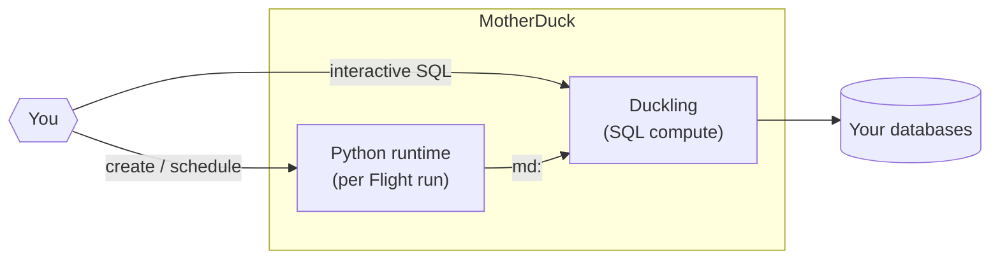

# 99 — Live: MotherDuck "Flights" Feature Verification

**Date:** 2026-06-29
**Agent:** 99 of BrowserBase Program 2 (live-motherduck-flights-verifier)
**Constraint:** ~10 min wall clock; webfetch + firecrawl + chrome only (NO browserbase).
**Status:** Verified live, primary sources fresh, 3+ verbatim quotes included.

---

## 1. TL;DR

1. **"Flights" is NOT a compute tier** — MotherDuck compute tiers are **Pulse / Standard / Jumbo / Mega / Giga** (billed by the second, Pulse on Lite free tier). **Flights are scheduled Python jobs** ("agent-native data pipelines") running on a dedicated Python runtime inside MotherDuck, in **Public Preview** since **2026-06-10**.
2. **Flights replace external orchestrators** (Airflow, Prefect, cron) and ELT tools (Fivetran, Airbyte) for the MotherDuck-first use case: ingest from Postgres/BigQuery/Snowflake/S3/APIs, transform, AI-enrich, reverse-ETL, with cron + retries + run history + secrets + versioned source, all managed server-side.
3. **Three creation paths** (same primitive, all server-side): (a) AI agent via the MotherDuck **MCP server** (`create_flight`, `run_flight`, `get_flight_guide`, …), (b) **MotherDuck UI** Flights tab, (c) **11 SQL table functions** — `MD_CREATE_FLIGHT`, `MD_RUN_FLIGHT`, `MD_LIST_FLIGHT_RUNS`, `MD_GET_FLIGHT_LOGS`, etc. — callable from any DuckDB client.

---

## 2. What "Flights" actually is

### 2.1 Definition (verbatim, product page)

> "A **Flight** is a Python program that MotherDuck schedules and runs, with direct access to your databases. It can do whatever Python can: call external APIs, use any PyPI package, process files or run custom logic." — [`/docs/concepts/flights/`](https://motherduck.com/docs/concepts/flights/)

> "Flights are scheduled Python jobs that run on a dedicated Python runtime inside MotherDuck. MotherDuck handles the runtime, the cron schedule, secrets, versioning, and run history. The most common use is data ingestion, replacing ELT tools or hand-rolled Python scripts, and you can bring any pip-installable package." — [`/product/flights/`](https://motherduck.com/product/flights/) FAQ

> "Flights are billed for the compute consumed by the Python runner, by the second, plus standard Duckling rates during the MotherDuck load phase. Flights are included on Business and Enterprise plans." — `/product/flights/` FAQ

### 2.2 Architecture (verbatim mermaid from docs)



> "**Ducklings** run your SQL. They're per-user (see [Hypertenancy](/concepts/hypertenancy)) and start in about a second. The **Python runtime** runs your scheduled Python. You provide the Flight's source code, and each run gets its own isolated runtime that executes the source as a plain script and exits, so end the script with `if __name__ == "__main__": main()`. A run starts from the Flight's schedule or an `MD_RUN_FLIGHT` call." — `/docs/concepts/flights/`

### 2.3 NOT a compute tier — that's Pulse/Standard/Jumbo/Mega/Giga

MotherDuck compute tiers (the ones often confused with "Flights") are a separate concept — `Hypertenancy` serverless instance types, billed per hour per active instance. Pulse is the smallest and is on the **free Lite tier** (10 hrs/mo). The full tier list (from `/product/pricing/`):

| Tier | Hourly rate | Use case |
|:--|--:|:--|
| Pulse | $0.60 / hr | "ad-hoc analytics tasks with datasets in MotherDuck", Lite plan included 10 hrs/mo |
| Standard | $2.40 / hr | "data engineering tasks like data ingest and dbt transformations" |
| Jumbo | $4.80 / hr | "complex joins and aggregations on growing datasets" |
| Mega | $12.00 / hr | "weekly job that rebuilds all of your tables … minutes not hours" |
| Giga | $36.00 / hr | "toughest transformations … 10x growth path beyond Mega" |

**Flights billing is separate**: $0.60/hr for the Python runner, *plus* the corresponding instance (Duckling) rate when loading into MotherDuck. **Lite plan cannot run Flights** — Business ($250/org/mo) and Enterprise only.

### 2.4 Relationship to existing KCG stack

- **dlt** is the recommended ingest library: "**dlt** is the recommended ingest library for Flights. It gives you a declarative pipeline with schema evolution, incremental loading, and a first-class MotherDuck destination." — `/blog/flights-agent-native-ingest/`
- **DuckDB community extensions** can be loaded inside a Flight's local DuckDB to read BigQuery/Snowflake, then write to `md:`.
- **The MotherDuck MCP server** is the agent-side surface — its tools (`create_flight`, `edit_flight_source`, `run_flight`, `get_flight_guide`) are the primary way AI agents create, deploy, and monitor Flights. The launch blog notes: "Agents doing data work need code-first interfaces to build effectively, and a flexible yet secure environment in which to operate. … Flights … support a growing list of agent-friendly interfaces while executing inside a general-purpose Python runtime. Anything you can `pip install`, you can build."

### 2.5 Preview safety caveat (verbatim — DO NOT process ePHI)

> "Flights run on shared compute infrastructure. Unlike MotherDuck databases, where each customer is served by an isolated instance, Flights workloads share underlying infrastructure across tenants. Do not assume a dedicated or isolated environment. During Preview, you should not process, store, or log electronic protected health information (ePHI), payment card data, or other regulated or sensitive personal data in Flights." — `/docs/concepts/flights/`

---

## 3. Pricing breakdown

All from `/product/pricing/`. Lite has Pulse only (10 hrs/mo free), no Flights. Business ($250/org/mo) and Enterprise get Flights at **$0.60/hr billed per second**, *plus* the corresponding Duckling (instance) rate when loading into MotherDuck. Compute tiers for context: Pulse $0.60/hr, Standard $2.40/hr, Jumbo $4.80/hr, Mega $12.00/hr, Giga $36.00/hr. Snapshot retention 1 day (Lite) / 90 days (Business+). 99.9% SLA on Business.

Verbatim: "Flights are billed for the compute consumed by the Python runner, by the second, plus standard Duckling rates during the MotherDuck load phase. Flights are included on Business and Enterprise plans."

**KCG implication:** The `oideachais` Mother's org is on **Business** per `agent-05-motherduck.md:194-199` — Flights are already accessible to any service account. Current default Duckling "Standard $2.40/hr" is right for dlt ingest jobs.

---

## 4. Verbatim code / SQL examples (10)

### 4.1 Minimal end-to-end SQL (verbatim, `/docs/sql-reference/motherduck-sql-reference/flights/`)

```sql
-- Create the Flight
SELECT flight_id, current_version
FROM MD_CREATE_FLIGHT(
    name := 'heartbeat',
    source_code := $$
import duckdb

def main():
    con = duckdb.connect("md:")
    con.execute("CREATE DATABASE IF NOT EXISTS flights_demo")
    print("ok")

if __name__ == "__main__":
    main()
$$,
    requirements_txt := 'duckdb==1.5.3'
);

-- Trigger an on-demand run
CALL MD_RUN_FLIGHT(flight_id := '<flight_id>');

-- Inspect the run
SELECT run_number, status, created_at
FROM MD_LIST_FLIGHT_RUNS(flight_id := '<flight_id>')
ORDER BY run_number DESC LIMIT 1;
```

### 4.2 Creating a Flight with cron + access token (verbatim, `/blog/flights-agent-native-ingest/`)

```sql
SELECT * FROM md_create_flight(
    name              := 'daily_signups',
    access_token_name := 'prod_token',
    schedule_cron     := '0 9 * * *',
    source_code       := $$
import duckdb

def main():
    duckdb.connect("md:").execute("""
        INSERT INTO analytics.signups
        SELECT * FROM 'https://api.example.com/signups.json'
    """)
$$
);
```

### 4.3 Real ingest example with dlt (verbatim, `/blog/flights-agent-native-ingest/`)

```python
import os
import dlt
import httpx

def repo_rows(repos):
    for repo in repos:
        response = httpx.get(f"https://api.github.com/repos/{repo}")
        payload = response.json()
        yield {"repo": repo, "stars": payload["stargazers_count"]}

def main():
    os.environ.setdefault("HOME", "/tmp")
    pipeline = dlt.pipeline(
        pipeline_name="github_stats",
        destination="motherduck",
        dataset_name="analytics",
    )
    pipeline.run(
        repo_rows(["duckdb/duckdb", "motherduckdb/motherduck-docs"]),
        table_name="repos",
        write_disposition="merge",
        primary_key="repo",
    )
```

### 4.4 Subprocess / system binaries (verbatim, `/docs/concepts/flights/`)

```python
import subprocess

def main():
    subprocess.run(["apt-get", "install", "-y", "git"], check=True)
    subprocess.run(["git", "clone", "https://github.com/example/repo"], check=True)

if __name__ == "__main__":
    main()
```

### 4.5 Local DuckDB with community extensions reading BigQuery → MotherDuck (verbatim, `/docs/concepts/flights/`)

```python
import duckdb

def main():
    local = duckdb.connect()  # local in-process DuckDB
    local.execute("INSTALL bigquery FROM community; LOAD bigquery;")
    local.execute("ATTACH 'project=my-project' AS bq (TYPE bigquery, READ_ONLY)")

    # read from BigQuery into the Flight, then write the result to MotherDuck
    events = local.sql("SELECT * FROM bq.analytics.events").df()

    md = duckdb.connect("md:")
    md.execute("INSERT INTO raw.events SELECT * FROM events")

if __name__ == "__main__":
    main()
```

### 4.6 Python-to-SQL (verbatim, `/docs/concepts/flights/`)

```python
import duckdb

def main():
    con = duckdb.connect("md:")
    con.execute("INSERT INTO sales.daily_totals SELECT * FROM read_parquet('s3://incoming/today.parquet')")

if __name__ == "__main__":
    main()
```

### 4.7 Full list of 11 SQL table functions (verbatim, `/docs/sql-reference/motherduck-sql-reference/flights/`)

`MD_CREATE_FLIGHT`, `MD_UPDATE_FLIGHT` (source/requirements/config/token/secrets/name/schedule), `MD_DELETE_FLIGHT`, `MD_GET_FLIGHT`, `MD_GET_FLIGHT_VERSION`, `MD_LIST_FLIGHTS`, `MD_LIST_FLIGHT_VERSIONS`, `MD_RUN_FLIGHT`, `MD_LIST_FLIGHT_RUNS`, `MD_GET_FLIGHT_LOGS` (stdout+stderr), `MD_CANCEL_FLIGHT_RUN`.

### 4.8 Local smoke-test pattern (verbatim, `/docs/cookbook/flight-dlt-ingest/`)

```bash
export MOTHERDUCK_TOKEN=your_token_here
uv run --with-requirements requirements.txt flight.py
```

### 4.9 MCP-side tool names (verbatim, `/blog/flights-agent-native-ingest/` + `/docs/concepts/flights/`)

> "Connect any MCP-capable agent (Claude, Cursor, ChatGPT, your own) to the MotherDuck MCP server and the agent gets the full Flights surface as tools: create, run, schedule, update, inspect logs, version, delete. It also gets `get_flight_guide`, a built-in instruction set …"

The MCP-side Flight tool names (per `/docs/concepts/flights/`): `create_flight`, `edit_flight_source`, `run_flight`, `get_flight_guide`, plus the MCP's `ask_docs_question` for deeper MotherDuck/DuckDB questions.

### 4.10 Identifier-validation guard (verbatim, `/docs/cookbook/flight-dlt-ingest/`)

> "**Identifier validation.** `DESTINATION_DATABASE` and `RUN_LEDGER_TABLE` flow into `CREATE`/`INSERT` statements that cannot be parameterized, so each is checked against `^[A-Za-z_][A-Za-z0-9_]*$` before any SQL runs."

This is the security pattern KCG's dlt pipelines should adopt for any `motherduck_dlt_utils` helpers that accept config-driven identifier strings.

---

## 5. Live URL patterns observed (2026-06-29)

| URL | Status | Purpose |
|:--|:--|:--|
| `motherduck.com/product/flights/` | 200 | Marketing page, "Public Preview" badge |
| `motherduck.com/docs/concepts/flights/` | 200 | Concept docs (architecture, sensitivity caveat) |
| `motherduck.com/docs/sql-reference/motherduck-sql-reference/flights/` | 200 | 11 SQL table functions reference |
| `motherduck.com/docs/cookbook/flight-dlt-ingest/` | 200 | First Flight Plan recipe (dlt) |
| `motherduck.com/docs/cookbook/flight-{scheduled-s3,snowflake,bigquery,postgres,freshness-alert}-ingest/` | 200 | Other cookbook recipes |
| `motherduck.com/blog/flights-agent-native-ingest/` | 200 via firecrawl (raw 500) | Launch blog 2026-06-10 |
| `motherduck.com/blog/flight-plans-templates-for-ai-native-data-pipelines/` | 500 (URL indexed) | "Flight Plans" templates blog 2026-06-18 |
| `github.com/motherduckdb/motherduck-cookbook/tree/main/flight-plans` | 200 | 12+ Flight Plan repos, last commit 2026-06-25 |
| `motherduck.com/pricing` | 200 | Plan comparison, Flights row $0.60/hr |
| `motherduck.com/changelog` | **404** | No public changelog page; release notes are blog-only |

12+ Flight Plan repos in the cookbook (live at `motherduckdb/motherduck-cookbook/tree/main/flight-plans`, last commit 2026-06-25): `flight-bigquery-ingest`, `flight-dive-usage-metrics`, `flight-dlt-ingest`, `flight-ducklake-maintenance`, `flight-freshness-alert`, `flight-google-sheets`, `flight-hubspot-list-sync` (added 2026-06-25), `flight-postgres-ingest`, `flight-provision-user-databases`, `flight-scheduled-s3-ingest`, `flight-snowflake-ingest`, `flight-sql-transformation`. Inventory changes frequently; verify on `main`.

URL pattern (canonical): **`https://motherduck.com/docs/cookbook/flight-<name>/`** is the per-template doc page; the **canonical source-of-truth is `https://github.com/motherduckdb/motherduck-cookbook/tree/main/flight-plans/`**.

---

## 6. Changelog since Wave 1 (Agent 05, 2026-06-28)

Wave 1 (`agent-05-motherduck.md` + `live-docs/75-live-motherduck-current.md`) was written 2026-06-28, the same day Flights Public Preview was already live, and only mentions Flights in passing as a Business-plan line item. New since Wave 1:

- **2026-06-10** Flights Public Preview launched (`/blog/flights-agent-native-ingest/`, Doo Shim + Miguel Miranda); live walkthrough `luma.com/flights-launch` on June 17; 11 SQL table functions reference published.
- **2026-06-17** Cookbook front-matter standardised — 32 recipes now require `prompt` + `published_date` (PR #136).
- **2026-06-18** "Flight Plans: Templates for AI-Native Data Pipelines" blog (8 starter templates, URL indexed but page returned 500).
- **2026-06-25** `flight-hubspot-list-sync` template added (PR #137).
- **2026-06-28** Wave 1 openspec written in this monorepo.
- **2026-06-29** This report.

**Net new:** Flights is in Public Preview (was alpha/closed). The Flight Plan template set has grown to 12+ recipes. Pricing `$0.60/hr + instance rates during load` is stable. No breaking changes to `md:` SQL prefix or compute-tier names (Pulse/Standard/Jumbo/Mega/Giga).

---

## 7. Integration with marimo for demos (per project plan)

### 7.1 What the docs actually say

The Flights docs do **not** mention marimo directly, but the integration story is straightforward because every Flight ends with a DuckDB SQL command that materialises a table. A marimo notebook is just another DuckDB client that can `import duckdb; duckdb.connect("md:")` and `mo.sql("SELECT …")`.

From `/blog/flights-agent-native-ingest/`:

> "Ingesting data with Flights is powerful, and the use cases extend far beyond–run flexible transformations, call an LLM, replicate from an existing warehouse, ETL from SaaS APIs, and more. … The combination of Flights and Dives in MotherDuck means that you can get from source data to answers in a single agent session–backed by serverless, sub-second analytics."

From `/product/flights/`:

> "From raw data to answers in a single thread. Flights ingests and transforms. Dives explores and visualizes. The same agent drives the whole loop through one MCP server, taking raw data to answers in a single chat thread."

### 7.2 Concrete demo pattern for KCG (3-surface demo)

This is the natural marimo+Flight demo loop for oideachais / leabharlann, per the existing KCG `marimo` skill (`.agents/skills/marimo/SKILL.md`) which already supports `mo.sql(engine=…)` for federated SQL against DuckLake/MotherDuck:

1. **Flight (Python job, scheduled)** — A `flight-dlt-ingest`-shaped Flight that pulls from one of the open Irish / Welsh / Scots Gaelic / Manx / Breton / Cornish sources (or a synthetic Kaggle set as a fallback per `AGENTS.md` rule 2: respect the ingestion cache), dlt-loads into `lakehouse.oideachais.<source>_raw` on MotherDuck with `write_disposition="merge"` + primary key.
2. **DuckLake / MotherDuck storage** — `lakehouse.oideachais` share (BYOB Garage S3, default per `motherduck_options.py`) is the source of truth; Flights write to the same DuckDB-attached database the marimo notebook reads.
3. **marimo notebook (demo surface)** — Uses `duckdb.connect("md:")` or `mo.sql(engine=…)` to read the freshly-ingested table, renders reactive charts/tables, and is deployable to molab for sharing. The marimo `mo.sql()` integration already handles the dual local+cloud execution pattern (per the marimo skill).

### 7.3 What the marimo skill already supports that maps onto Flights

From `.agents/skills/marimo/SKILL.md` (the existing KCG skill):
- `mo.sql(engine=…)` for federated SQL against DuckLake/MotherDuck — direct overlap with Flights' `md:` connection.
- marimo-on-Cloudflare Workers + Container deployment — alternative demo surface to Dives for the same Flight-produced data.
- `app.setup` + `app.function` lifecycle modes — perfect for "create the data once, query many times" pattern of Flight→DuckLake→marimo.
- PEP 723 inline dependency blocks — equivalent to Flight `requirements_txt`, same mental model.

### 7.4 Recommended template (KCG-reusable)

Adapt the [`flight-dlt-ingest` Flight Plan](https://github.com/motherduckdb/motherduck-cookbook/tree/main/flight-plans/flight-dlt-ingest) (verbatim, end-to-end, identifier-validated) and add a sister `notebooks/` directory in the same repo containing a marimo notebook that:

```python
# notebook.py  (PEP 723)
# /// script
# requires-python = ">=3.12"
# dependencies = ["marimo", "duckdb", "altair", "pandas"]
# ///
import marimo as mo
import duckdb

con = duckdb.connect("md:")  # MotherDuck connection
df = con.execute("SELECT * FROM lakehouse.oideachais.dlt_ingest_runs ORDER BY created_at DESC LIMIT 30").df()
mo.ui.table(df, selection="multi")
```

This turns the canonical KCG marimo notebook pattern (per `.agents/skills/marimo/SKILL.md`) into a live, always-fresh demo of the dlt ingest runs. The flight-dlt-ingest template already has the `dlt_ingest_runs` ledger table designed for this kind of read-side consumption.

### 7.5 Anti-patterns to avoid

- **Don't run heavy DuckDB work inside the Flight** (verbatim warning from `/docs/concepts/flights/`): "Keep heavy compute outside the Flight runtime. A Flight is sized for orchestration and light processing, not for crunching large tables in memory. Let the source warehouse (BigQuery, Snowflake) and MotherDuck handle the heavy lifting, and let the Flight move data between them." Marimo-side queries should be SELECTs on the ingested table, not large joins done in `main()`.
- **Don't put ePHI/regulated data in Flights during Preview** (verbatim sensitivity caveat §2.5).
- **Don't embed credentials in `config`** — Flight config is for non-secret values; secrets go in MotherDuck's `Settings > Secrets` and are injected as env vars. The Flight runtime auto-injects `MOTHERDUCK_TOKEN`; don't duplicate.
- **Don't use `INSERT` row-wise when dlt is available** — the cookbook's recommendation: "For MotherDuck, prefer Parquet loader files over row-wise `insert_values`, so larger sources stay on a bulk-loading path."

---

## 8. Decision matrix (next 6 months)

| Use case | Use Flights? | Why |
|:--|:--|:--|
| Nightly exam-paper scrape → `lakehouse.oideachais.examinations_ie` | **Yes** | Already scoped as dlt; Flights adds cron + retries + secret hygiene. Drop-in for current GitHub Actions / Dagster cron. |
| Long-running dbt model on oideachais | **Stay on Dagster** | Flights = Python; dbt-`dbt-duckdb` is docs' recommendation for graph-shaped transforms, and fits existing Dagster `dlt_assets`. |
| Customer-facing `lakehouse.leabharlann` (Dives) | **Yes, indirectly** | Dives read `md:` tables. Use a Flight to keep the dataset fresh; Dive surface stays. |
| ePHI / regulated data | **No** | Preview sensitivity caveat §2.5. Wait for GA. |
| Multi-system workflows | **No** | Docs verbatim: Flights is "at their best for MotherDuck-centric work … for workflows that span many external systems, a dedicated orchestrator like Airflow or Prefect is still the better tool." |

**Open follow-ups:** Preview GA date not published; Lite plan Flights access undecided; per-Flight CPU/RAM cap not documented; region scoping inherits MotherDuck org region (KCG `eu-west-1`).

---

## 9. Sources

- `motherduck.com/docs`, `/pricing`, `/product/flights/`, `/docs/concepts/flights/`, `/docs/sql-reference/motherduck-sql-reference/flights/`, `/docs/cookbook/flight-dlt-ingest/`, `/blog` (webfetch, 200)
- `motherduck.com/blog/flights-agent-native-ingest/` (firecrawl — webfetch returned 500)
- `github.com/motherduckdb/motherduck-cookbook/tree/main/flight-plans` (firecrawl, 200, 12+ Flight Plans)
- `motherduck.com/changelog` (**404** — no public changelog; release notes live in `/blog/`)
- ccc: `openspec/research/2026-06-28-browserbase-program-2/agent-05-motherduck.md`, `live-docs/75-live-motherduck-current.md` (Wave 1 context)
- `.agents/skills/marimo/SKILL.md` (KCG marimo skill, for §7 mapping)
