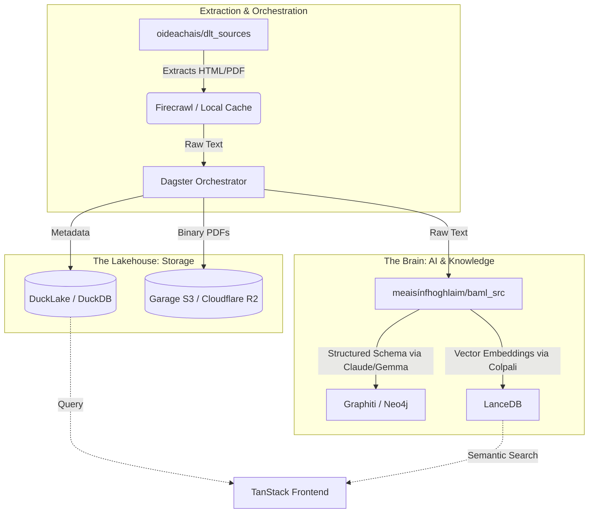

# Cianfhoghlaim Oideachais
*A Bilingual, BAML-First Agentic Platform for the Irish Education System — Aistear, Primary, Junior Cycle, Senior Cycle, Tertiary.*

 <!-- Update path if needed -->

## The Vision
Cianfhoghlaim Oideachais is a bilingual (EN/GA) agentic platform that covers the **entire** Irish education system: Aistear (early childhood), Primary, Junior Cycle, Senior Cycle, and Tertiary (CAO + QQI-FET + Apprenticeship). It pairs the BAML-extracted knowledge of NCCA specifications, SEC exam papers, marking schemes, Chief Examiner reports, and CAO/NUI matriculation rules with an Agno stage-team architecture, a Cognee-backed knowledge graph, and a CopilotKit/AGUI-powered TanStack Start front-end.

---

## Core Architecture: The Dual-Stack

### The Quadrant Architecture & Interoperability
The platform is heavily decoupled into four sovereign quadrants to isolate state, infrastructure, and inference:

1. **`infrastructure/` (The Foundation)**: Provides zero-trust mesh ingress (`Pangolin`), fleet orchestration (`Komodo`), identity (`PocketID`), and secrets (`Infisical`).
2. **`oideachais/` (The Engine)**: Houses the `Dagster` orchestrator, `DLT` extractors, and the `TanStack` frontend UI.
3. **`meaisínfhoghlaim/` (The Brain)**: Manages model routing (`LiteLLM`), extraction schemas (`BAML`), and AI memory graphs (`Cognee`, `Graphiti`).
4. **`tuatha/` (The Edge)**: Manages distributed node states, agent interactions, and cryptographic token tracking (`x402`).




To maintain a strict separation of concerns, the project is divided into two distinct halves: Python-based Data Engineering and TypeScript-based Full-Stack Web Development.

### 1. `oideachais/data_platform` (Python / Data & Agents)
This is the engine room of the platform, managed with `uv` for lightning-fast Python dependency resolution.
*   **Data Pipelines (`dlt`, `dagster`)**: Ingests, normalises, and tracks provenance for every Irish syllabus, exam paper, and marking scheme. Upgraded to `dlt v1.5+` featuring **dltHub Projects & Caching** for local DuckDB transformations, and `dagster v1.13+` for robust orchestration.
*   **Knowledge Graphs & Memory**: Utilises `graphiti-core` and `cognee` to build temporal context graphs of student progress and curriculum structures.
*   **Agentic Orchestration (`google-adk`, `agno`)**: `Agno` (v2.0+) provides stateless AgentOS workflows, while `Google ADK` (v2.1+) offers a Multi-Agent Workflow Engine for complex task routing between specialist agents.
*   **Deep Web Exploration (`browserbase`, `firecrawl`)**: Agents utilise MCP servers to execute autonomous, JavaScript-rendering web scrapes for dynamic educational content discovery.
*   **Codebase Indexing (`chunkhound`)**: Transforms raw repositories into searchable, AST-chunked semantic databases.

### 2. `oideachais/web_app` (TypeScript / TanStack / Cloudflare)
The user-facing portal, built on the bleeding-edge of the React ecosystem and managed primarily via `bun`.
*   **TanStack Start**: A full-stack SSR/CSR framework providing type-safe file-based routing (`@tanstack/react-router`) and server functions (`createServerFn`), heavily optimised for edge deployment on **Cloudflare**.
*   **CopilotKit & Generative UI**: Moving beyond simple chat windows. Agents utilise `@tanstack/ai` and CopilotKit to stream state changes directly into the UI, rendering dynamic React components (AgUI) in real-time.
*   **MotherDuck Embedded Dives**: Delivers zero-latency, client-side analytics. MotherDuck's dual-execution engine pushes a DuckDB-WASM instance directly into the browser, allowing students to filter and explore massive datasets (like CSO statistics or exam results) instantly.
*   **Celtic Dark Mode (Tailwind v4)**: An immersive UI drawing inspiration from RPGs (*Hades*, *Clair Obscur*). Features deep `slate-900` backgrounds, tactile "Duolingo-style" buttons, Ogham stone noise textures, and specific Celtic-nation accent colours.

---

## Deployment & Development Guide

**Why order matters:** This is a highly distributed system. Agents need API access, pipelines need databases, and the frontend needs the pipelines. Furthermore, **secrets are managed dynamically and must be hydrated before anything else runs.**

### Prerequisites
1.  **[mise](https://mise.jdx.dev/)**: Used to manage tool versions globally and execute directory-specific environment hooks (automatically injecting secrets).
2.  **[uv](https://github.com/astral-sh/uv)**: The blazingly fast Python package installer and resolver.
3.  **[bun](https://bun.sh/)**: The preferred, high-performance JavaScript runtime and package manager used for the `web_app`. (*NPM/Node instructions are retained as legacy fallbacks where strictly necessary for obscure package compatibility*).
4.  **Docker Desktop / OrbStack**: Required for backing services.

### Step-by-Step Initialization

#### Step 1: Infisical & Secrets (The Locket)
*You cannot run MCPs or data pipelines without credentials.*
We use Infisical for centralised secret management, deployed via a sidecar pattern ("Locket").
```bash
# 1. Ensure you have the Infisical CLI installed via your package manager
# 2. Login to your Infisical account
infisical login

# 3. Export secrets to the local environment (Mise hooks normally handle this automatically)
# This resolves your `.infisical.env` template into a hydrated, git-ignored `.env` file.
infisical export --env=dev > .env
```

#### Step 2: Spin Up Backing Infrastructure
Start the vector databases (LanceDB), graph databases (Neo4j), temporal memory services, and the Locket sidecar.
```bash
# Deploys compose.yaml overlaid with sidecar.yaml for secure tmpfs secret mounting
docker compose -f compose.yaml -f sidecar.yaml up -d
```

#### Step 3: Run the Data Platform (Python)
Hydrate MotherDuck and your vector stores with the Irish curriculum datasets.
```bash
cd oideachais/data_platform

# Install dependencies blazingly fast
uv sync

# Run the Dagster UI to orchestrate DLT pipelines manually
uv run dagster dev -m dagster_defs.definitions
```
*(Inside the Dagster UI, trigger the `ireland_curriculum` and `exam_source` assets to pull the latest SEC and NCCA data into your dltHub Projects cache and MotherDuck).*

#### Step 4: Start the Web App (TypeScript)
With data populated and secrets hydrated, spin up the TanStack application.
```bash
cd ../web_app

# Install dependencies using Bun
bun install

# Start the TanStack dev server
bun run dev
```
*(Note: If you encounter specific Vite/Rollup plugin incompatibilities with Bun during builds, fallback to `npm run dev`).*

---

For deeper technical details on specific modules, please consult the respective READMEs inside `oideachais/` and the `.skills/` directory.

<!-- AGENT_TELEMETRY_START -->
> **Agent Telemetry (Last Updated: 2026-05-24 17:10:15 UTC)**
> - **Total Cached Structural Documents:** 7010
> - **Examinations.ie Cache:**     1635 files
> - **NCCA.ie Cache:**     1778 files
> - **CurriculumOnline Cache:**     3597 files
<!-- AGENT_TELEMETRY_END -->


# 1. Create a new service account
gcloud iam service-accounts create gemini-dev-sa \
    --description="Service account for Gemini API" \
    --display-name="Gemini Dev SA"

# 2. Grant it the Vertex AI User role
gcloud projects add-iam-policy-binding YOUR_PROJECT_ID \
    --member="serviceAccount:gemini-dev-sa@YOUR_PROJECT_ID.iam.gserviceaccount.com" \
    --role="roles/aiplatform.user"

# 3. Generate and download the JSON key file
gcloud iam service-accounts keys create ~/path/to/save/sa-key.json \
    --iam-account=gemini-dev-sa@YOUR_PROJECT_ID.iam.gserviceaccount.com


Here is a comprehensive guide to deploying your Dagster + MotherDuck architecture, automating the pipeline with your tools, and utilizing the generated data to build study plans based on the 2026 timetable.
1. Deploying Dagster, MotherDuck, and the Agentic Stack
Your oideachais application is already well-structured with Docker Compose, handling the orchestration (Dagster), the backend (FastAPI + LiteLLM), and the frontend (TanStack Start + CopilotKit).
Step 1: Hydrate Secrets for MotherDuck and Cloudflare
Ensure your local environment or .infisical.env template has the required credentials. storage/config.py is already set up to read MOTHERDUCK_TOKEN and fallback to local DuckDB.
MOTHERDUCK_TOKEN="md_..."
MOTHERDUCK_DATABASE="oideachais"
GARAGE_ACCESS_KEY="lakehouse"
GARAGE_SECRET_KEY="devpassword"
# Cloudflare R2
R2_ACCESS_KEY_ID="..."
R2_SECRET_ACCESS_KEY="..."
Run your Infisical sync: bun run init-vault.ts in scripts/infisical/ to hydrate via mise.
Step 2: Spin up the environment
Navigate to the oideachais directory and start the stack:
cd /Users/cianmacandeisigh/dev/kings_college_galway/oideachais
docker-compose up -d dagster api frontend litellm
Because of USE_DUCKLAKE="true", Dagster and the FastAPI API will now route DuckDB queries to MotherDuck while utilizing your curriculum_unified.duckdb data. The TanStack frontend at http://localhost:3000 will stream the CopilotKit AI interactions.
2. Automating the Pipeline (Dagster + dlt + cocindex + R2)
I have scaffolded a new Dagster asset file for you at oideachais/assets/leaving_cert_assets.py to automate this workflow. Here is how the architecture handles it:
1. 
Extraction (Garage S3 + dlt): 
A dlt pipeline scrapes curriculumonline.ie and examinations.ie. The raw PDF binary files are routed instantly to Garage S3 (s3://education-documents/syllabus/). dlt infers the schema and writes the metadata (subject, year, S3 path) directly into MotherDuck.
2. 
Vision Indexing (cocindex + LanceDB): 
Dagster triggers an asset that retrieves the PDFs from Garage S3 and passes them to cocindex (powered by ColPali). Instead of brittle text OCR, ColPali creates multi-vector embeddings of the page visuals (crucial for Math formulas and Biology diagrams) and stores them in LanceDB/MotherDuck.
3. 
Agentic Generation (FIBO + tuatha):
We invoke the existing tuatha/fibo_generation logic. The system extracts CurriculumConcept and LearningOutcome nodes. BAML + LiteLLM generate visual FIBO JSON configurations (e.g., diagram_type="molecular" for Chemistry).
4. 
Caching & Distribution (Cloudflare R2):
The finalized JSON study plans and FIBO-generated images are uploaded to a Cloudflare R2 bucket. Using Cloudflare's edge caching provides zero-egress, low-latency delivery directly to your TanStack web application.
3. Study Plans & Marking Schemes for 2026 Sample Subjects
By cross-referencing your 2026 Leaving Certificate Timetable with the tuatha research and syllabus data, here is how the CopilotKit agent formulates marking schemes and study plans for the students:
Gaeilge (Irish) - June 8 & 9
- 
Syllabus & Exam Integration: Paper 1 (Monday) heavily focuses on the Cluastuiscint (Aural) and Ceapadóireacht (Composition). The pipeline extracts marking schemes to show students how the Sraith Pictiúr and oral exams are scored heavily on stór focal (vocabulary) and cruinneas (grammar accuracy).
- 
Study Plan Agent: Generates spaced repetition modules for grammar in the final weeks leading up to the clustered exams, and uses FIBO to generate visual narrative arcs for the standard prose/poetry (Paper 2, Tuesday).
English - June 3 & 4
- 
Syllabus & Exam Integration: Paper 1 (Comprehending & Composing) and Paper 2 (Comparative & Single Text). The cocindex pipeline parses past examiners' reports to extract the core grading logic: PCLM (Purpose, Coherence, Language, Mechanics).
- 
Study Plan Agent: The agent uses Graphiti memory to cross-reference the student's chosen comparative texts against the PCLM rubric, ensuring their essay structure aligns with examiner expectations.
Mathematics - June 5 & 8
- 
Syllabus & Exam Integration: Paper 1 (Algebra, Calculus) on Friday; Paper 2 (Statistics, Geometry) on Monday. Text-based RAG fails at math, but cocindex successfully retrieves visual equations and geometric proofs from past papers. 
- 
Study Plan Agent: FIBO generates visual, step-by-step resolution diagrams for common 50-mark question formats, helping students visualize integration and statistical bell curves.
Geography (June 5) & History (June 10)
- 
Syllabus & Exam Integration: For Geography, the agent extracts the concept of SRPs (Significant Relevant Points), where 2 marks are awarded per distinct factual point. For History, it analyzes the marking matrix for the RSR (Research Study Report) and structured essays.
- 
Study Plan Agent: FIBO visualizes geographical processes (e.g., tectonic plate boundaries). For History, the agent uses tuatha data to map out verifiable chronological timelines that maximize SRP accumulation.
Biology (June 9) & Chemistry (June 16)
- 
Syllabus & Exam Integration: The exams heavily penalize missing mandatory keywords. cocindex extracts diagrams of mandatory experiments (e.g., titrations, cell plasmolysis).
- 
Study Plan Agent: Uses your tuatha schemas (VisualRequirement(diagram_type="molecular") for Chemistry and diagram_type="cell_diagram" for Biology). The agent generates active recall quizzes targeting the strict marking scheme keywords required for full marks.
German (June 12)
- 
Syllabus & Exam Integration: Written & Aural. The pipeline analyzes past paper rubrics for the Äußerung zum Thema (opinion piece) and Leseverstehen (reading comprehension).
- 
Study Plan Agent: Focuses on thematic vocabulary clustering and visual templates for formal/informal letter writing, caching the templates in Cloudflare R2 for fast retrieval during study sessions.
Next Steps
1. 
Navigate to the UI at http://localhost:3000. 
2. 
Open the CopilotKit chat interface. 
3. 
You can now prompt the agent: "Show me the marking scheme breakdown for the 2026 Biology mandatory experiments using the MotherDuck index." The agent will query DuckDB, retrieve the ColPali image embeddings of the syllabus, and stream the generated study plan directly to the frontend.


